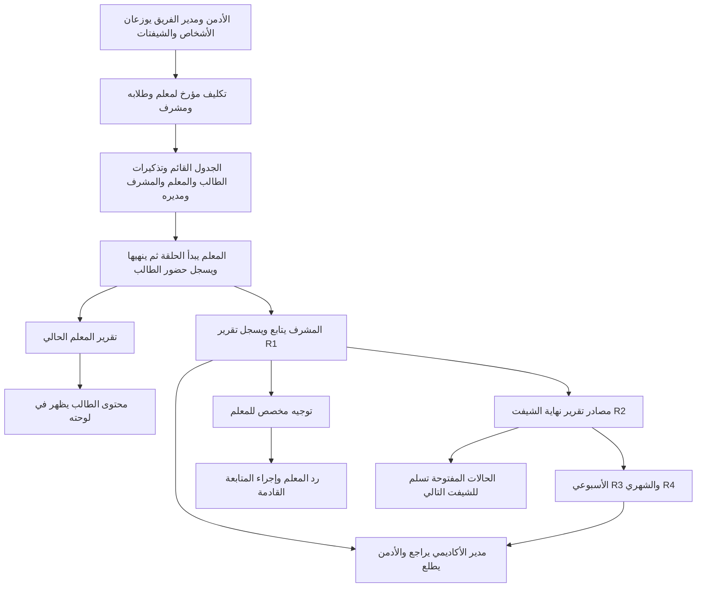
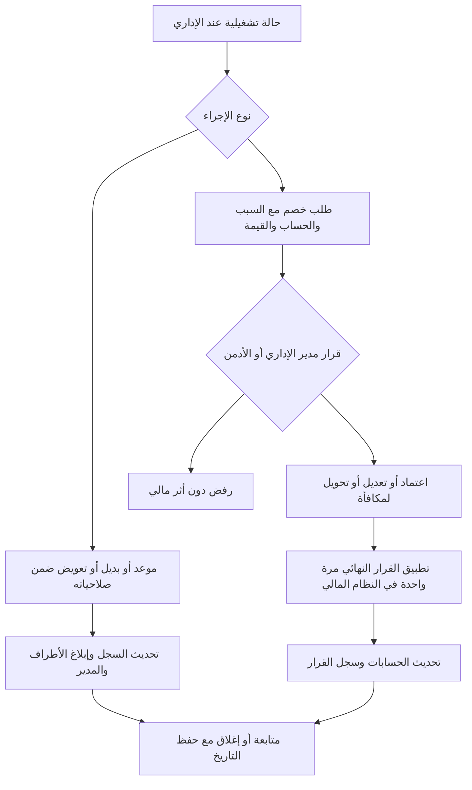

# النسخة الثالثة — طلبات الأكاديمية وخطة المراحل

> **نسخة الخطة الكاملة المحدثة 2026-09-28:** هذا هو ملف التنفيذ الرئيسي المطلوب، و[ملحق الدمج](PHASE_3_INTEGRATION_ADDENDUM_AR.md) هو الملف الثاني للتعديلات المصاحبة على المنصة القائمة. أضيفت صلاحيات مدير الأكاديمي الثلاثة عشر ونماذج التقارير الأربعة ومخططات التدفق والتقدير الزمني في الأقسام 9–13. بدأ تنفيذ V3-1 بموافقة صاحب المشروع؛ باقي المهام تُتابع بخانات الحالة أدناه.

> **تحديث إجابات 2026-09-25:** [سجل القرارات والأسئلة المتبقية](PHASE_3_DECISIONS_AND_OPEN_QUESTIONS_AR.md) مرجع القرارات التشغيلية. الإداري يغير الموعد ويختار البديل ويضيف التعويض؛ الخصم يحتاج قرار مديره ويمكن تحويله لمكافأة. المعلم يسجل حضور الطالب عند الإغلاق. مهلة التقارير ساعتان، ومدير كل فريق يرى فريقه فقط.

> **الحالة:** مرحلة الفلو V3-0 أُنجزت توثيقيًا، وبدأ تنفيذ V3-1 بموافقة صريحة من صاحب المشروع بتاريخ 2026-09-28. `[ ]` يعني لم يبدأ، و`[-]` قيد التنفيذ، و`[x]` نُفذ وتحققنا منه، و`[!]` متوقف مع السبب. خانات الفلو المكتملة تعني وثيقة قرار؛ خانات الميزات لا تُحوّل إلى `[x]` لمجرد التخطيط.

> **قرار نطاق أحدث:** تفاصيل الاختبار الفعلي ومعايير النجاح وحساب نقاط المعلم والترتيب تُدار خارج المنصة. لذلك لا ننشئ في V3 محرك امتحان أو معادلة نقاط وترتيب تلقائيًا. يبقى تقرير المتابعة الوصفي وتسجيل نتيجة أو قرار إداري داخل المنصة فقط إذا كانت لهما حاجة تشغيلية مثبتة في مرحلة التقرير؛ المقترحات الرقمية القديمة أدناه ليست تكليفًا برمجيًا معتمدًا.

## اللوحات الأربع الجديدة فوق لوحات المنصة الحالية

| اللوحة | ما يظهر ويُدار فيها | مراحل اكتمالها |
|---|---|---|
| المشرف الأكاديمي | شيفته وتكليفاته وحلقاته ومتابعة الجودة والتقارير والملاحظات والدعم | أساس الهوية والشيفت V3-1، عمل الحلقة والتقرير V3-6، والمتابعة الدورية V3-7/8 |
| المشرف الإداري | شيفته وجدول الحلقات والتنبيهات والتغييرات والتعويضات وتسليم الحالات | أساس الهوية والشيفت V3-1، تشغيل اليوم V3-3، الاستثناءات V3-4، والتسليم V3-5 |
| مدير الإشراف الأكاديمي | أعضاء فريقه وتوزيعهم وتقاريرهم ومراجعة جودة الحلقات والمتابعة المجمعة | أساس النطاق V3-1، إدارة الفريق V3-2، والبيانات الأكاديمية V3-6/7/8 |
| مدير الإشراف الإداري | أعضاء فريقه وتوزيعهم والتغطية والحالات والتسليم والحسابات وفق صلاحياته | أساس النطاق V3-1، إدارة الفريق V3-2، وبيانات التشغيل V3-3/4/5/8 |

هذه **أربع مساحات وظيفية مستقلة بصلاحيات ونطاق بيانات مختلفين**، إضافية إلى لوحات الأدمن والمعلم والطالب الحالية. واجهة V3-1 تعرض أساس الشيفتات والتكليفات من شاشة مشتركة تتكيّف مع الدور؛ اكتمال محتوى كل لوحة يحصل في مراحلها المبينة، ولا تُعد اللوحات الأربع منجزة بنهاية V3-1.
> **حدود المصدر:** هذا الملف يسجل ما طلبه صاحب المشروع وما ورد في نص مهام الإشراف الأكاديمي والصور. التغييرات اللازمة للدمج التي استنتجناها من المنصة الحالية موثقة منفصلة في [ملحق الدمج](PHASE_3_INTEGRATION_ADDENDUM_AR.md). لا نعامل الافتراضات أو الأسئلة المفتوحة كقرار معتمد.

المصدر الإضافي: المرفق `e8f9e562-cb66-4519-89d9-01483051bcb8/Pasted text.txt` بتاريخ 2026-09-28. تكراره لخطوات العمل القديمة لا يلغي استبعاد تجهيز الجروبات أو اعتماد مهلة التقارير ساعتين أو مسؤولية الأكاديمي عن تأخر تقرير المعلم؛ هذه قرارات صريحة سابقة. نموذج الحلقة التفصيلي يضم النموذج المختصر الموجود في المرفق نفسه، ولا يُنشئ تقريرين لنفس المشاهدة.

## 1. فهم الطلب وحدوده

- [ ] إضافة إشراف **أكاديمي** وإشراف **إداري**، مع مدير لكل فريق يرى فريقه فقط ويراجع تقاريره ويدير تبديل مشرفيه، والأدمن يرى ويدير الفريقين؛ الإداري يغير الموعد ويختار البديل ويضيف التعويض ضمن نطاقه، ويعتمد مديره طلبات الخصم أو يرفضها أو يعدلها أو يحولها لمكافأة.
- [ ] إدارة الحسابات والأعضاء والصلاحيات والتكليفات ومواعيد الشيفتات والتبديل من لوحة الأدمن. العدد الحالي التقريبي للأفراد ليس حدًا تقنيًا.
- [ ] دعم عدد شيفتات قابل للتغيير، وشيفتات متزامنة ومتداخلة، وأكثر من مشرف في الشيفت الواحد؛ لا نفترض 4 شيفتات ثابتة ولا مشرفًا واحدًا للشيفت.
- [ ] بناء لوحات/مساحات عمل مناسبة للمشرف الأكاديمي والإداري ومدير كل فريق بعد اعتماد حدود الصلاحيات، مع اطلاع الأدمن وتحكمه في كل تدفق جديد.
- [ ] ربط سير الإشراف بلوحات المعلم والطالب حيث تؤثر المهمة عليهم، دون تكرار الحقائق الموجودة أصلًا في الحصص أو التقارير أو الجداول.

## 2. نطاق الإشراف الإداري المطلوب من الأكاديمية

وصلت دورة العمل الإداري التفصيلية بعد النسخة الأولى من هذه الخطة. البنود التالية تحفظ **الطلب التشغيلي كما ورد**؛ ترجمة الشيتات والجروبات إلى بيانات وإجراءات داخل المنصة موثقة في [ملحق الدمج](PHASE_3_INTEGRATION_ADDENDUM_AR.md). لا نفترض أن صلاحية المتابعة تساوي صلاحية اعتماد تغيير مالي أو تعويض.

### أ. الجداول والشيتات

- [ ] إعداد جدول الحلقات من المواعيد، وتسليمه للإشراف الأكاديمي، وتحديثه عند أي تغيير.
- [ ] تحديث بيانات الطالب عند نقله أو تغيير موعده وتسجيل كل تعديل. تحديث وصف جروبات واتساب عمل خارجي مستبعد من تطوير المنصة وفق الإجابة الأحدث.
- [ ] تسجيل الاعتذارات والحلقات التعويضية وتحديث حالتها بعد التنفيذ؛ تحديث بيانات الحسابات دون فقد التاريخ.

### ب. قبل الحلقة وأثناءها

- [ ] تذكير قبل الموعد بـ30 دقيقة ورسالة «الحلقة الآن» قبل الموعد بـ5 دقائق للطالب والمعلم والمشرفين المكلفين ومدير الإشراف المختص وفق نطاقه؛ داخليًا وخارجيًا إن أمكن وإلا داخليًا فقط.
- [ ] التحقق من الجاهزية والرابط ومتابعة بدء المعلم للحلقة وإنهائها وتسجيله حضور الطالب أو غيابه عند الإغلاق، ومتابعة المشرف لأي اختلاف في ما حدث؛ لا يُستنتج حضور الطالب تلقائيًا من زر بدء المعلم.
- [ ] متابعة جروبات الحلقات والرد على رسائل الطالب والمعلم والاستفسارات، والتأخير والغياب والطوارئ أثناء الحلقة.
- [ ] إيجاد معلم بديل إذا غاب أو اعتذر المعلم وكان البديل مناسبًا للطالب، وإبلاغ الإشراف الأكاديمي بالمستجدات.

### ج. بعد الحلقة والتغييرات والتعويضات

- [ ] الحفاظ على إتاحة تقرير المعلم للطالب عند الإرسال وفق الحقول المسموحة، والتحقق من بيانات الحصة ومهامها؛ مسؤول متابعة تأخر تقرير المعلم هو الأكاديمي حسب التوضيح الأحدث. تطلب المنصة رأي الطالب خصوصًا بعد الحصة التجريبية أو الأولى.
- [ ] إدارة اعتذار الطالب أو المعلم وتأجيل/تقديم/تغيير الموعد واختيار البديل وإضافة التعويض بواسطة الإداري ضمن نطاقه، مع ظهور الإجراء لمديره وإخطار الأطراف والأكاديمي والشيفت التالي عند الحاجة.
- [ ] طلب خصم بسبب واضح من الإداري إلى مديره؛ يوافق المدير أو يرفض أو يعدل أو يحول إلى مكافأة، ولا حركة مالية قبل اعتماد القرار النهائي. الحسابات عرض آلي للمستحقات والمدفوعات وأرصدة المعلمين والطلاب لمدير الإداري والأدمن.
- [ ] متابعة كل تعويض من الاستحقاق إلى الاتفاق على موعد وتنفيذ الحلقة وإغلاق الحالة، دون ترك تعويض معلق بلا مالك.

### د. الطالب والمعلم الجديدان

- [ ] عند الحملة أو الطالب الجديد: إعادة استخدام التسجيل والمواعيد الحالية وإبلاغ الطالب والأكاديمي بالموعد. إنشاء الجروب وتجهيزه مستبعدان من التطوير ومن قوائم متابعة المنصة؛ معنى Draft إن كان مادة مستقلة يبقى غير محسوم.
- [ ] متابعة أول حلقة وطلب رأي الطالب بلطف وتثبيت المواعيد وتحديث بيانات المنصة حتى استقرار الجدول.
- [ ] عند المعلم الجديد: إعادة استخدام رحلة الجاهزية والإسناد الموجودة وربطها بالإشراف عند الحاجة؛ لا إعادة بناء الرحلة أو تجهيز جروب له.

### هـ. المهام والطوارئ والتواصل والتسليم

- [ ] متابعة الإحصائية والمهام والحالات المعلقة، إغلاق المنجز، وتحديد مسؤول واضح لكل حالة قبل انتهاء الشيفت.
- [ ] معالجة غياب/تأخير/عدم دخول/خلل رابط/طلب تغيير/بديل وأي حالة تؤثر على الحلقة، مع التصعيد للمسؤول الأعلى عند الحاجة.
- [ ] عدم ترك رسالة في جروبات العمل تخص مسؤولية الشيفت بلا رد أو إجراء، مع توثيق نتيجة الطلب في المنصة.
- [ ] تسليم الحالات التشغيلية عند نهاية الشيفت مع عرض التقارير الناقصة؛ مهلة إرسال التقارير ساعتان بعد نهايته دون تأخير، ثم يظهر التنبيه للمدير والأدمن. الحسابات لمدير الإداري والأدمن فقط. فصل التسليم التشغيلي عن اكتمال التقارير مقترح لتنفيذ المهلة دون تعطيل الشيفت التالي.

## 3. نطاق الإشراف الأكاديمي المطلوب من الأكاديمية

### أ. الجدول والحلقات

- [ ] استلام جدول الحلقات اليومي من الإشراف الإداري، ومراجعة عدد حلقات الشيفت ومواعيدها ومعلميها وطلابها.
- [ ] متابعة تنفيذ الجدول، دخول الحلقة في موعدها، وحضور المعلم والطالب.
- [ ] متابعة جميع الحلقات المكلف بها المشرف وجودتها والتزام المعلم، وتقييم المعلم بعد كل حلقة وتسجيل حضور المتابعة والملاحظات والمشكلة والإجراء في نطاق الاختصاص.

### ب. تقرير الحلقة والتنسيق

الرسالة الأصلية طلبت إرسال التقرير إلى جروب الإشراف وجروب المعلم. أوضح صاحب المشروع لاحقًا أن المقصود **نقل وظيفة الجروبين إلى المنصة**؛ لذلك تعتمد البنود التالية التوضيح الأحدث.

- [ ] كتابة تقرير الحلقة بعد انتهائها مع مهلة حتى نهاية الشيفت + ساعتين؛ يظهر النقص أثناء المهلة والتأخير بعدها مع اسم المسؤول لمديره والأدمن.
- [ ] تقرير المشرف لكاتبه ومديره والأدمن فقط؛ المدير يراجع جميع تقارير فريقه ويملك تعديلها بسجل تغيير، وتصل الملاحظة الموجهة للمعلم إلى صندوق متابعته ويلزم الرد أو تأكيد التنفيذ. لا تُفتح تقارير الزملاء لكل الفريق تلقائيًا.
- [ ] إظهار حالة التقرير وإجراء المتابعة، ومنع تضارب التقرير الإشرافي مع تقرير الحلقة الذي يكتبه المعلم حاليًا.

### ج. دعم المعلم والفئات والمناهج

- [ ] طلبات مساعدة المعلم وتوفير البيانات والـMaterials والمحتوى اللازم، مع تسجيل التوجيهات ونقاط التحسين ومتابعة تنفيذها.
- [ ] توزيع المعلمين على المشرفات الأكاديميات بحسب فئات محددة، مع مراعاة مستويات الطلاب وتحديد/مراجعة المناهج المناسبة لكل فئة.
- [ ] تقييم المعلمين بعد كل حلقة مع نقاط للتقييم والأداء والقوة والاحتياج للدعم، وقوائم المتميزين ومن يحتاجون متابعة وأثر التوجيهات؛ بنود النقاط وأوزانها تحتاج اعتمادًا.

### د. الطالب والحالات الاستثنائية

- [ ] متابعة اعتذار الطالب أو المعلم، الغياب، والتأجيل، وتسجيل الأثر الأكاديمي والتنسيق مع الإداري في الإجراء التشغيلي.
- [ ] تحديد استحقاق الطالب لاختبار عند إنجاز جزء محدد من المنهج، إجراء الاختبار، تسجيل نتيجته وتوجيه المعلم بناء عليها.
- [ ] رصد إنجازات الطالب وتطور مستواه، وتصنيف من تميز أو يحتاج متابعة.
- [ ] معالجة المشكلة الأكاديمية ضمن اختصاص المشرف، وتحويل المشكلة التقنية إلى الإداري، ومتابعة الحالات المشتركة بين الفريقين.

### هـ. الإحصاءات والترشيحات

- [ ] إحصاء نهاية اليوم: إنجازات الطلاب والمعلمين والملاحظات الأكاديمية.
- [ ] إحصاء نهاية الأسبوع: تطور الطلاب وأداء المعلمين ونقاط القوة والمتابعة.
- [ ] إحصاء نهاية الشهر: الإنجازات والترشيحات والمتابعة، أفضل 10 طلاب بالأكاديمية وفق آلية تقييم تعتمد لاحقًا، وترشيح أفضل معلم ومعلمة.
- [ ] تسليم الإحصاءات والتقارير الدورية للجهة الإدارية المعتمدة، مع بيان مصدر كل رقم وفترته الزمنية.

## 4. الفلو التشغيلي المبدئي

```text
الأدمن ينشئ الأعضاء والصلاحيات والفئات والشيفتات والتكليفات
                 ↓
الإشراف الإداري يجهز/يسلم جدول الحلقات وتعديلاته
                 ↓
تذكيرات 30/5 دقائق + متابعة الجاهزية والغياب والرابط
                 ↓
المشرف الأكاديمي يرى حلقات نطاقه وشيفته ومعلمي فئته
                 ↓
متابعة حضور المعلم والطالب وجودة الحلقة والمشكلة/الاعتذار
                 ↓
المعلم يُكمل تقرير الحلقة القائم + المشرف يسجل متابعة أكاديمية
                 ↓
الإداري يتابع تقرير المعلم وإتاحته للطالب والحالات التي تتطلب Feedback
                 ↓
توجيه أو اختبار أو تصعيد إداري عند الحاجة
                 ↓
اعتذار/تأجيل/بديل/تعويض عبر سجل واحد → تسليم المعلق للشيفت التالي
                 ↓
تقارير يومية/أسبوعية/شهرية → مراجعة المدير المختص → اطلاع الأدمن
```

هذا الفلو **تصور قابل للتعديل**. حُسمت صلاحية تغيير الجدول والبديل والتعويض واعتماد الخصم وتوجيه التذكيرات. اقتراح تقييم المعلم وتفاصيل الاختبار تنتظر المراجعة قبل مرحلتهما. التقرير يوجّه داخليًا تلقائيًا؛ التواصل الخارجي لا يشترط لنجاحه.

## 5. خطة التنفيذ المقترحة — 10 مراحل داخل النسخة الثالثة

> المراحل مرقمة بالاعتماد لا بالتاريخ؛ لا نبدأ مرحلة برمجية حتى يحدد صاحب المشروع بدايتها ونطاقها. بعد وصول 12 محورًا إداريًا فُصل التشغيل الإداري إلى ثلاث مراحل قابلة للمراجعة بدل حشده في مرحلة واحدة.

### V3-0 — تحديد نموذج التشغيل وحدود المسؤولية — مكتمل توثيقيًا

- [x] تحديد رحلة الحلقة داخل وخارج المنصة ومصدر الحقيقة للحصص والتقارير والتسليم.
- [x] إعداد مصفوفة وصول مبدئية للمشرفين والمديرين والأدمن والمعلم والطالب، مع حجب الصلاحيات الحساسة غير المعتمدة.
- [x] تحديد سيناريوهات الشيفتات المتغيرة والمتداخلة وتعدد المشرفين وقاعدة مسؤول أساسي لكل حلقة.
- [x] تحديد توجيه تلقائي داخل المنصة للعمل الذي كان يُنشر في جروبي المعلم والإشراف، مع بقاء الجروبات نفسها للتواصل والتكامل الخارجي اختياريًا.
**شرط الخروج تحقق:** نموذج تشغيل مكتوب قابل للبناء عليه. تفاصيل النقاط والاختبار الفعلي خارج المنصة وفق القرار الأحدث؛ صلاحيات الإجراء الإداري ومسار قرار الخصم حُسمت كما في سجل القرارات.

### V3-1 — الهوية والصلاحيات وبنية التكليف والشيفت

- [x] توسيع هوية الموظف داخل النظام القائم دون تحويل المشرف إلى معلم أو طالب، مع حساب مستقل لكل نوع من الأنواع الأربعة.
- [x] إنشاء شيفتات مرنة وتكليف مؤرخ لمجموعة معلمين وطلابهم مشتقة من الجداول الحالية؛ يمكن لمدير الفريق أو الأدمن تبديل المشرف مع حفظ فترة المسؤولية السابقة دون رقم ثابت للشيفتات أو الأفراد.
- [x] تحقق خادمي من الصلاحيات والنطاق ومنع تعارض المشرف الأساسي للفريق والمعلم في الفترة نفسها، مع فهارس زمنية وقفل تغيير متزامن؛ اختبارات مستهدفة وبناء الواجهة نجحت.
- [x] ربط ملكية التقرير ومهلة الساعتين بتكليف **وقت الحلقة** لا بتكليف المشرف الجديد؛ نُفذ مع R1 في V3-6.
**شرط الخروج V3-1 البرمجي تحقق:** يستطيع الأدمن إنشاء أربع شيفتات أو عشرين وأعضاء متزامنين عبر واجهة الأساس بلا حد ثابت لعدد الشيفتات. اختبار التشغيل على قاعدة بيانات حقيقية والقبول الشامل في V3-9. الفحص الكامل الحالي للخادم فيه أربع حالات فاشلة في وحدة تسجيل منفصلة عليها تغييرات سابقة خارج V3-1؛ اختبارات الإشراف والصلاحيات المستهدفة نجحت.

### V3-2 — إدارة الأدمن ومديري الإشراف

- [x] إدارة الأعضاء والتفعيل/الإيقاف والمناصب والفئات والشيفتات والتبديل والتغطية وصلاحيات المديرين؛ نقل العضو أو إيقافه مشروط بتسليم تكليفاته وشيفتاته المستقبلية.
- [x] عرض المسؤولين عن الحلقات الفعلية حسب الفترة، بما فيهم المشرف الإضافي، والتنبيه البصري للتغطية الناقصة، وسجل تغييرات محصور بكل فريق.
- [x] إعدادات محفوظة لكل فريق لمستلمي إشعارات تغييرات التكليفات والشيفتات، ومهلة تقرير المشرف الافتراضية ساعتين، وفترة التصعيد والفئات ذات الأولوية، مع تاريخ سريان وسجل تدقيق. تنفذ مهلة التقرير والتصعيد على R1 عند بنائه في V3-6؛ لا ننشئ إنذارًا لتقرير غير موجود.
- [x] تأسيس أربعة مسارات منفصلة للمشرفين ومديري الفريقين وهوية مدير الأكاديمي وقائمة الأقسام الحقيقية المتاحة الآن: الرئيسية والفريق والشيفتات والتكليفات والتغطية والسجل والسياسات. تستكمل M03–M13 وفق مصادر البيانات والتوجيهات والتقارير في V3-3 إلى V3-8، دون مؤشرات وهمية.
- [x] مراجعة تقارير المشرف R1 والتنبيه عند نقصها بعد المهلة في V3-6؛ بقي تقرير المعلم القائم سجلًا مستقلًا مرتبطًا بالحصة.
**شرط الخروج:** لا توجد خطوة إشرافية جديدة لا يستطيع الأدمن متابعتها أو إدارتها بصلاحية مناسبة.

### V3-3 — تشغيل اليوم والتذكيرات الإدارية

- [x] قائمة حلقات الإداري من `Session` والتكليفات المؤرخة، وتسليم إشعار بالجدول الحي للمشرفين الأكاديميين ومديرهم، ومتابعة جاهزية الطالب والمعلم والرابط، وإشارة بدء المعلم وفتح الطالب للرابط، مع حالة متابعة يدوية مرتبطة بالحصة ومسؤول وإغلاق موثق. فتح الرابط أو إعلان البدء لا يثبت دخول Zoom/Meet.
- [x] تذكيرات داخل المنصة قبل 24 ساعة وساعة و30 و15 و5 دقائق، بفحص كل 15 ثانية ونافذة استدراك قصيرة ومفتاح فريد يضم موعد الحصة والمستلم؛ تُفحص حالة الحصة وموعدها قبل التسليم، فلا يُرسل الجديد لحصة ملغاة أو موعد قديم. البريد اليومي الموجود يستمر كقناة إضافية حسب توافره، دون ادعاء تكامل واتساب.
- [x] إظهار تقرير المعلم المستحق في قائمة الحلقات، وتنبيه المعلم ومدير ومشرف الأكاديمي عند نقصه بعد عشر دقائق من اكتمال الحصة، مع زر متابعة إضافي. التقرير المرسل يظهر للطالب فورًا ويصله إشعار وقت الإرسال، مع حصر حقول الطالب على ما يخصه؛ لا ينتظر اعتماد المدير.
**شرط الخروج:** يستطيع الإداري تشغيل يوم الحصص ورؤية ما تأخر، ويصل التذكير في وقته دون إرسال خاطئ.

**التحقق:** بناء العميل وفحص واجهته، واختبارات التذكير والتقرير ونطاق بيانات الطالب وواجهات اليوم المستهدفة نجحت. تبقى تجربة إرسال فعلية مع MongoDB والشيفتات والحصص الحقيقية ضمن V3-9؛ لا يوجد تكامل واتساب للتذكيرات.

### V3-4 — التغييرات والطوارئ والتعويضات

- [x] دورة حالات اعتذار/غياب/تأخير/تأجيل/تقديم/تغيير موعد/خلل رابط/معلم بديل مناسب/تعويض، مع مالك وتصعيد وإبلاغ الأكاديمي.
- [x] ربط الإجراءات بمحركات الجدول والحصة والمحفظة والتوفر الحالية، وإغلاق التعويض بعد تنفيذه مع حفظ التاريخ.
- [x] تنفيذ دورة طلب الخصم وقرار مدير الإداري أو الأدمن بما فيها الرفض والتعديل والتحويل لمكافأة، مع تحديد صاحب الحساب والمبلغ/الوحدة والسبب وحفظ التاريخ ومنع تكرار الأثر المالي.
- [x] إظهار الحالات المفتوحة وما ينتظر الشيفت التالي، ومنع حالة بلا مسؤول أو موعد متابعة.
**شرط الخروج:** كل استثناء له إجراء وحالة وتاريخ، ولا يضيع تعويض أو يتغير رصيد الطالب مرتين.

**التحقق:** نجحت اختبارات الصلاحيات والخصم/المكافأة وربط التعويض والغياب التلقائي، وبناء العميل واختباراته. تجربة MongoDB فعلية للحصص والشيفتات والرصيد ضمن V3-9. اختيار ملاءمة المعلم البديل قرار بشري للإداري؛ يتحقق النظام من نشاطه وعدم تعارض الموعد فقط. الشيفت التالي يرى الحالات المفتوحة ويمكن لمديره نقل مالكها؛ محضر التسليم الرسمي في V3-5.

### V3-5 — الطلاب والمعلمون الجدد وتسليم الشيفت

- [x] ربط أول حلقة فعلية وطلب رأي الطالب بعد اكتمالها وتثبيت المواعيد بوجود جدول نشط؛ تعتمد متابعة الإداري على `Session` و`ScheduleRule` ومسار الإنشاء الحالي. لا إنشاء جروبات أو قائمة تجهيز لها. تُعاد الاستفادة من جاهزية المعلم الحالية، ويُبلّغ مدير الأكاديمي عند اكتمالها.
- [x] تسجيل حضور وانصراف صاحب الشيفت وتسليم الحالات عند نهايته من المعلق الحي، مع ملخص بشري وإشعار الفريق التالي؛ لا يحجب نسيان تسجيل الحضور تسليم العمل ويظهر نقصه. التقرير له مهلة مستقلة حتى ساعتين بعد النهاية ثم تظهر حالة التأخير.
- [x] يرى مدير الفريق والأدمن حالة تسليم كل عضو وتقريره ونقصه أو تأخيره والمهام المسندة إليه، والحسابات من دفاتر الحركات للإداري المخوّل فقط.
- [x] إنشاء R2 أولي من الحصص والحضور المسجل والحالات مع مسودة خلاصة المشرف ونسخة ثابتة عند الإرسال؛ يظهر اختلاف المصدر اللاحق بوضوح، ولا إعادة كتابة الأعداد.
- [x] ربط قائمة وعدد الحلقات التي تابعها المشرف فعليًا بمصدر R1 في V3-6؛ تُحفظ ضمن لقطة R2 عند الإرسال، مع فصل المشاهدة عن التقرير المرسل والتقييم.
**شرط الخروج:** يعرف الشيفت التالي ما يستلمه، وتُتابَع رحلة الطالب/المعلم الجديد حتى الاستقرار دون إعادة كتابة البيانات.

**التحقق V3-5:** نجحت اختبارات الصلاحية والتسليم والمهلة والتقرير ورأي أول حلقة وإشعار المعلم الجديد، وبناء الواجهة. تحقق التشغيل الحي من بيانات الشيفتات والأرصدة ضمن V3-9. تبقى خطوة R1 المحددة أعلاه في V3-6.

### V3-6 — متابعة الحلقة والتقرير الأكاديمي

- [x] مساحة عمل للمشرف الأكاديمي: حلقات نطاقه والحضور والملاحظات والجودة والتصعيد وتقرير المتابعة الوصفي، ومتابعة تقارير المعلمين المتأخرة.
- [x] ربط تقريره بتقرير المعلم القائم، وتوجيه الملاحظة إلى صندوق المعلم للرد والتقرير إلى مدير الفريق والأدمن فقط بجانب كاتبه، ومراجعة كل التقارير وتوثيق تعديلها.
- [x] عند إرسال التقرير، توجيه تلقائي وآمن مرة واحدة لمن عليهم الاطلاع أو إجراء، وإظهار حالة الإرسال/المراجعة/الرد دون نسخ التقرير أو المطالبة بإرساله يدويًا لجروب.
- [x] تنفيذ نموذج R1 مع التقييم الوصفي بأربع درجات ونقطة المتابعة للحلقة القادمة؛ لا يُبنى نظام نقاط رقمي في هذا النطاق.
- [x] تسجيل حضور المشرف أو عدم حضوره ووقت المتابعة ومصدره وربطه بالتقرير، مع التمييز بين متابعة الحلقة وتقديم تقييمها.
**شرط الخروج:** يمكن تتبع حلقة واحدة من موعدها إلى إغلاق متابعتها، مع سجل لمن فعل ماذا ومتى.

**التحقق V3-6:** نجح بناء العميل واختباراته، واختبارات الخادم المستهدفة للملكية والرؤية والتنبيه والربط مع R2. فحص الخادم الكامل أبقى إخفاقات التسجيل الأربعة السابقة نفسها؛ التشغيل الحي على بيانات وشيفتات حقيقية واختبار الأدوار في المتصفح ضمن V3-9. وقت المشاهدة مصدره تصريح يدوي من المشرف ولا يثبت دخوله Zoom/Meet تلقائيًا.

### V3-7 — المعلم والطالب والمنهج والاختبارات

- [x] توزيع فئات المعلمين عبر الكتالوج والتكليفات القائمة، والتوجيهات والمواد ذات الرؤية المحددة، وتقييمات R1 الوصفية ودعم المعلم.
- [x] تقدم الطلاب والخطط المرتبطة بالمناهج والإنجازات من سجلات الحفظ والمراجعة والتقييم الموجودة؛ تسجيل نتيجة اختبار أُجري خارج المنصة دون محرك درجات أو استحقاق آلي.
- [x] توجيه مدير الأكاديمي لمشرف أو معلم أو فئة أو جميع أعضاء نطاقه مع لقطة مستقلة لكل مستلم وحالة ورد واعتماد تنفيذ، وسجل تطوير مؤرخ للمعلم والمشرف، ومراجعة المدير لتعديل الخطة مع استمرار ظهور النسخة المنشورة حتى قراره.
**شرط الخروج:** تظهر النتائج ذات الصلة لكل طرف بحدود خصوصيته، ولا تُنشأ بيانات إنجاز مكررة.

**التحقق V3-7:** نجح بناء العميل و97 اختبارًا، والفحص المستهدف لصلاحيات المرحلة والتقرير السابق. فحص الخادم الكامل أبقى إخفاقات التسجيل الأربعة السابقة نفسها؛ اختبار رحلة حقيقية ببيانات Mongo وأدوار المستخدمين في المتصفح ضمن V3-9. المواد روابط HTTPS مع تحديد رؤيتها، والاختبار نفسه وتحديد النجاح خارج المنصة وفق القرار المعتمد.

### V3-8 — الإحصاءات والترشيحات والتقارير الدورية

- [x] مؤشرات يومية/أسبوعية/شهرية قابلة للتصفية حسب الشيفت والفريق والفئة، مع مصادر أرقام واضحة وصفحات للحصص الداخلة في كل مؤشر. يحسب حضور الطالب من سجل حضور معتمد فقط، ولا تتكرر الحصة بتعدد المشرفين.
- [x] ترشيحات الطلاب والمعلمين يراجعها مدير الأكاديمي وفق سجلات الإنجاز والتقييم البشري؛ يختار شهريًا حتى 10 طلاب ومعلمًا ومعلمة من ترشيحات R4 المعتمدة مع سبب وسجل تعديل. لا يُحسب ترتيب نقاط آلي.
- [x] تنفيذ R3 الأسبوعي وR4 الشهري بأرقام من المصادر، وتحليل وصفي وترشيحات وشيفتات فعلية، وإكمال مؤشرات المدير والبحث المقيد عبر الطلاب والمعلمين والمشرفين والحلقات وR1.
- [x] مراجعة المدير للتقارير الدورية مع سجل إصدارات، ولقطة الأعداد وفترتها ومصادرها، وإشارة تغير المصدر دون تغيير النسخة المعتمدة بصمت؛ التصحيح المعتمد نسخة جديدة بسببه.
**شرط الخروج:** يستطيع المدير والأدمن استخراج الأرقام نفسها للفترة نفسها دون اختلاف تعريفها.

**التحقق V3-8:** نجح بناء العميل و97 اختبارًا له، واختبارات الخادم المستهدفة للحدود والنسب والصلاحيات واللقطات. الفحص الشامل للخادم: 69 من 70 مجموعة و675 من 679 اختبارًا؛ الإخفاقات الأربعة القديمة في وحدة التسجيل نفسها. تجربة Mongo الحية وقبول المتصفح والأدوار ضمن V3-9. ليست هناك مهلة آلية جديدة لتقرير R3/R4 أو نشر آلي للترشيحات.

### V3-9 — الدمج والاختبار والإطلاق المتدرج

- [ ] فحص صلاحيات الأدوار الخمسة، التزامن والتبديل بين الشيفتات، الحالات الاستثنائية، والتوافق مع بيانات المرحلة الثانية.
- [ ] اختبار واجهات الأدمن والمديرين والمشرفين والمعلم والطالب، العربية/الإنجليزية وRTL والجوال، والإشعارات والتقارير.
- [ ] تجربة تشغيلية على بيانات اختبار ومراجعة قبل إتاحة الأدوار الجديدة لباقي الأكاديمية.
**شرط الخروج:** قبول تشغيلي موثق وسجل عيوب مغلق؛ لا يُعلَّم التنفيذ مكتملًا اعتمادًا على البناء وحده.

**تقدم التحقق 2026-09-29:**
- [x] رحلة MongoDB معزولة وقابلة للإعادة: عزل خمسة أدوار، شيفتات متداخلة، حضور وتسليم وتقرير نهاية الشيفت بلا تكرار، تكليفات مؤرخة، تنبيهات 30/5 للمستلمين المكلفين مرة واحدة وإيقاف التنبيه للموعد القديم، حصة مشتركة للفريقين، R1 ومراجعة المدير ورد المعلم، حالة إدارية ونقل مسؤولها وإغلاقها، مؤشرات فعلية وR4 وترشيحات معتمدة. قاعدة التجربة تُحذف بعد الفحص.
- [x] دخول سريع تطويري لأربع هويات إشراف مستقلة؛ فُحص تسجيل الدخول العادي والسريع ومسار كل لوحة في المتصفح، مع حجب روابط الجوال التي لا يملك الدور صلاحيتها. لا يُعرض الدخول السريع في بناء الإنتاج.
- [x] بناء العميل و97 اختبارًا له، و70 مجموعة/682 اختبارًا للخادم. أصلح الفحص رفض مسؤول الحالة الإداري رغم تكليفه، وخطأ إلغاء رصيد الحصص عند فشل إنشاء جدول التسجيل، وخطأ اختيار نوع الفترة في المؤشرات اليومية.
- [x] فحص قراءة بيانات المنصة السابقة دون تعديلها: ظهرت الحصص القديمة في قائمة اليوم وتغطية الأدمن، مع تمييز غير المسند بدل نسبة هذه الحصص لمشرف لم يكن مكلفًا بها.
- [ ] قبل تشغيل الإشراف على الحصص القائمة: يوزع المديرون المعلمين على المشرفين والشيفتات بتواريخ صحيحة؛ مؤشرات الإشراف الفردية لا تضم الحصص السابقة خارج فترة تكليف حقيقية.
- [ ] مراقبة تشغيل مهمة التذكير المجدولة نفسها عبر مرور الزمن، والتوافق على عينات بيانات V2 المختارة، ومراجعة الإنجليزية وسائر شاشات المعلم والطالب بالجوال. فُحصت واجهات دخول الأدمن والمعلم والطالب والأدوار الأربعة بالعربية، ولوحات الإشراف الأربع على عرض 390px وRTL بلا تمرير أفقي أو روابط جوال غير مصرح بها.
- [ ] تجربة أصحاب المنصة التشغيلية وتوثيق قبولهم وإغلاق العيوب قبل الإطلاق المتدرج.

## 6. تفاصيل تُحسم قبل تنفيذ الجزء المرتبط بها

أُغلقت أسئلة التشغيل والصلاحيات والحسابات والتذكيرات وحضور الطالب بإجابات 2026-09-25. أوضح صاحب المشروع لاحقًا أن نقاط التقييم والاختبار الفعلي خارج المنصة؛ لا تُطرح أسئلتهما كشرط لبدء مراحل النظام.

المناهج والإحصاءات واختصاص الطوارئ معلومة من الرسالتين، وإدارة الجروبات والاستيراد الآلي مستبعدان. لا يتطلب أساس V3-1 كل تفاصيل المراحل اللاحقة، لكنه لا يبدأ قبل موافقة صاحب المشروع الصريحة.

## 7. تدقيق تغطية رسالة الإشراف الأكاديمي — 2026-09-24

هذا **فحص اكتمال الخطة فقط**؛ لا يعني تنفيذ الميزات. تمت مطابقة محاور الرسالة الأحد عشر مع البنود أعلاه وملحق الدمج:

1. **استلام ومراجعة الجدول:** §3/أ وV3-3، مع توليد قائمة الحلقات من الجدول القائم بدل شيت مكرر.
2. **متابعة الحلقات والحضور والجودة:** §3/أ وV3-6؛ تأكيد المشرف منفصل عن مجرد فتح رابط الاجتماع.
3. **تقرير ما بعد الحلقة والجروبان:** §3/ب وV3-6؛ التقرير يُسجل مرة واحدة وتوجّه المنصة ما يخص المعلم والفريق والمدير والأدمن تلقائيًا، وتظل الجروبات الحالية موجودة للتواصل.
4. **دعم المعلمين والـMaterials والتوجيه:** §3/ج وV3-7 مع صندوق متابعة المعلم.
5. **الاعتذارات والغيابات والتأجيلات:** §3/د وV3-4، مع فصل الأثر الأكاديمي عن الإجراء الإداري وربطه بالسياسات الحالية.
6. **تقييم المعلمين ونقاط القوة والمتابعة:** §3/ج وV3-7 وV3-8.
7. **فئات المعلمين ومستويات الطلاب والمناهج:** §3/ج وV3-7 وربطها بكتالوج المناهج الحالي.
8. **اختبارات الطلاب عند إنجاز جزء محدد:** §3/د وV3-7، وتبقى آلية الاستحقاق والدرجة والاعتماد قرارًا تشغيليًا لاحقًا.
9. **إنجازات الطلاب وتطورهم:** §3/د وV3-7 وV3-8 من بيانات الحفظ والمراجعة والتقييم القائمة.
10. **إحصاءات اليوم والأسبوع والشهر والترشيحات:** §3/هـ وV3-8؛ تُحسب تلقائيًا من السجلات، وتحتاج معايير معتمدة لترشيحات التميز.
11. **المشكلات والتصعيد للأكاديمي/الإداري:** §3/د وV3-4/V3-6 مع مالك واضح للحالة المفتوحة وتسليم الشيفت.

المحاور العابرة المشمولة كذلك: أربعة أنواع عمل إشرافي/إداري مع مديرين، تحكم الأدمن، صلاحيات ونطاق بيانات، شيفتات مرنة ومتداخلة، تأثيرات واجهتي المعلم والطالب، الإشعارات، التسليم، التدقيق، ومراجعة التوافق مع المرحلة الثانية. **لا يوجد نقص معروف في نقل بنود الرسالة إلى الخطة.** المتبقي اعتماد نموذج التقييم وتفاصيل الاختبار، مع مراجعة مقترحات التنفيذ عند تصميمها.

## 8. تدقيق تغطية رسالة الإشراف الإداري — 2026-09-24

هذه مطابقة للنطاق وليست علامة إنجاز برمجي. **المحاور الاثنا عشر وصلت وأُدرجت جميعًا في §2** وفي مراحل التشغيل الإداري V3-3 إلى V3-5 وملحق الدمج:

1. **الجداول والشيتات:** جدول واحد من بيانات الحصص القائمة وتحديث النقل والمواعيد؛ الحسابات لمدير الإداري والأدمن. وصف الجروبات خارج التطوير حسب الإجابة الأحدث.
2. **قبل الحصة:** تذكير 30/5 دقيقة، الجاهزية والرابط والدخول، والتنبيه عند فشل البداية.
3. **أثناء الحصة:** رسائل الطلاب والمعلمين والتأخير والغياب والمشكلات، والبديل المناسب وإبلاغ الأكاديمي.
4. **بعد الحصة:** متابعة تقرير المعلم ووصوله للطالب، اكتمال البيانات، Feedback للحالة الجديدة/التجريبية.
5. **الاعتذارات والتأجيلات والتغييرات:** جميع الأنواع المذكورة، مع إعلام الأكاديمي والشيفت التالي.
6. **التعويضات:** تحديد الموعد والتنفيذ والإغلاق مع سجل تاريخي وعدم ترك حالة بلا مالك.
7. **الطالب الجديد والحملات:** أول حلقة وطلب رأي الطالب وتثبيت الجدول؛ خطوات تجهيز الجروب مستبعدة من التنفيذ حسب الإجابة الأحدث، وDraft يحتاج توضيحًا فقط إن كان مادة مستقلة للمنصة.
8. **المعلم الجديد:** إعادة استخدام رحلة الجاهزية الموجودة وإبلاغ الأكاديمي وربطه بالحلقات؛ لا متابعة تجهيز جروب.
9. **المهام والإحصائية:** متابعة المعلق وإغلاق المنجز وتحديد المسؤول.
10. **الطوارئ:** غياب/تأخير/عدم دخول/خلل رابط/تغيير/بديل والتصعيد.
11. **التواصل:** الرد أثناء الشيفت، مع تسجيل النتيجة المهمة في المنصة بدل ضياعها في الجروب.
12. **تسليم الشيفت:** الحلقات والتعديلات والتعويضات والمعلق والإحصائية والحضور عند النهاية؛ تقارير المشرف لها مهلة ساعتين دون تأخير حسب الإجابة الأحدث، والحسابات لصاحب الصلاحية فقط.

**ملاحظة معمارية مهمة اكتُشفت أثناء المراجعة:** تذكيرات المنصة الحالية 24 ساعة/ساعة/15 دقيقة، لكن مهمة الإرسال تفحص كل 30 دقيقة؛ لا نعتمد عليها كما هي لتنبيه مطلوب قبل 5 دقائق. هذا تعديل لازم ضمن V3-3، مع منع التكرار بعد تغيير موعد الحصة. ونترجم «حذف التعويض بعد تنفيذه» إلى إغلاق حالة مع حفظ التاريخ ضمن V3-4، لا حذف سجل حصة أو حركة مالية.

## 9. مدير الإشراف الأكاديمي — مطابقة محاور المرفق الجديد

مدير الأكاديمي له حساب وظيفي وصلاحيات مستقلة عن المشرف والمعلم داخل نظام الهوية نفسه. يرى جميع بيانات الجانب الأكاديمي الذي يديره بما فيها المعلمون والطلاب والحلقات، ولا تمنحه كلمة «جميع» وصولًا لحسابات الإداري المالية أو تقاريره الداخلية. الأدمن يملك الرؤية والإدارة المجمعة. عند تعدد المديرين يطبّق النطاق المسند لكل واحد.

- [ ] **M01 الرئيسية:** أعداد المشرفين والمعلمين والطلاب والحلقات، المنفذ والملغى، ما يحتاج متابعة، التقييمات والملاحظات الجديدة والتنبيهات المهمة. يبدأ الإطار في V3-2 وتستكمل مصادر المؤشرات في V3-6 وV3-8.
- [ ] **M02 المشرفون:** قائمة المشرفين وفئة كل منهم وحلقاته وتقييماته وتقاريره، إضافة توجيه له وقياس الالتزام بالمهام. V3-2 وV3-6 وV3-7.
- [ ] **M03 المعلمون:** البيانات والخبرات والطلاب المسندون والتقييمات وتقارير حضور المشرف ونقاط القوة والتطوير والتوجيهات والتطور الزمني. V3-6 وV3-7.
- [ ] **M04 الحلقات:** المعلم والطالب والموعد والحالة وتقرير المعلم وملاحظاته وتقرير المشرف وإنجاز الطالب، وتصفية بالتاريخ والمعلم والمشرف والطالب والفئة والحالة. V3-3 وV3-6.
- [ ] **M05 حضور المشرف:** حلقات حضرها وأخرى لم يحضرها، وقت الحضور والتاريخ والطرفان والتقرير والتوجيه المرسل؛ مصدر التسجيل ظاهر ولا يحسب فتح الرابط حضورًا موثقًا تلقائيًا. V3-6.
- [ ] **M06 تقارير الإشراف:** الأداء ومستوى الطالب ونقاط القوة والتطوير والتوجيه والمتابعة السابقة وتنفيذها؛ مراجعة جميع تقارير الفريق وسجل تعديلها. V3-6 وV3-7.
- [x] **M07 الطلاب:** المستوى والحفظ والمراجعة والإنجاز والخطة القادمة وتقييمات المعلمين وملاحظات المشرفين والتطور عبر الزمن من مصادرها القائمة. V3-7؛ المؤشرات المجمعة في V3-8.
- [x] **M08 المناهج والخطط:** منهج الفئة من كتالوج المقررات، وخطة الطالب وتدرجها والمنفذ وموادها واحتياجه الفردي، واعتماد تعديل المشرف من المدير. V3-7.
- [x] **M09 التوجيهات:** إرسال لمشرف أو معلم أو فئة أو للجميع في الفريق الأكاديمي الحالي، مع نص وتاريخ وحالة تنفيذ واعتماد مستقل لكل مستلم. V3-7.
- [x] **M10 التقارير والإحصاء:** يومي وأسبوعي وشهري من الحصص والحضور المعتمد وR1 وسجلات الإنجاز؛ فصل عدد المتابعة والتقييم والإرسال وإظهار النسب ومقامها. أضيف تصنيف اختياري لأبرز ملاحظة في R1 لحساب تكرار الفئات المختارة؛ النصوص الحرة والتقارير القديمة غير المصنفة لا تُحلل دلاليًا ولا تُصنّف تلقائيًا. V3-5 وV3-6 وV3-8.
- [x] **M11 البحث:** بحث موحد محدود النتائج عن طالب أو معلم أو مشرف أو حلقة أو R1 مع نطاق وصلاحيات وروابط للسجل. V3-8.
- [ ] **M12 الصلاحيات:** اطلاع ومراجعة وتقييم وتوجيه للجانب الأكاديمي كاملًا ضمن نطاقه، مع فصل الحساب عن دور المشرف والمعلم. V3-1 وV3-2 مع تحقق وصول بكل مرحلة.
- [x] **M13 سجل المتابعة:** تقييمات R1 وملاحظات وتوجيهات المعلم السابقة، وتقارير وتوجيهات المشرف، وحالات تطوير مؤرخة توثق ما تحسن وما يستمر تحت المتابعة. V3-7؛ تجميع المؤشرات في V3-8.

معيار قبول مساحة المدير: كل مؤشر يفتح مصدره الحقيقي، وكل توجيه يظهر لصاحبه ويتتبع رده، وكل تقرير مقيد بنطاق صحيح. وجود القائمة أو بطاقة بلا بيانات فعلية لا يحقق المهمة.

## 10. نماذج التقارير ومن يكتبها وأين تظهر

وصلت نماذج فعلية لأربعة تقارير. أعداد الأسطر الفارغة وأسماء المثال وتكرار الزخارف ليست حدودًا للبيانات أو حقولًا إلزامية إضافية. لا نفرض تسع حلقات أو أربعة متميزين بسبب طول النموذج الورقي.

### R1 — تقرير الإشراف الأكاديمي على الحلقة

- **الهوية من المنصة:** المعلم والطالب والتاريخ ووقت الحلقة والمشرف ومعرّف الحصة، دون إعادة كتابتها.
- **يكتبه المشرف:** سير الحلقة، مستوى الطالب، أداء المعلم، أهم الملاحظات، نقاط القوة، ما يحتاج تحسينًا، توجيه للمعلم، هل يحتاج متابعة في الحلقة القادمة، نقطة المتابعة القادمة، وملاحظة ختامية.
- **التقييم العام الوارد:** ممتاز، جيد جدًا، جيد، يحتاج إلى تحسين. يظل تقييمًا وصفيًا ولا يتحول تلقائيًا إلى نقاط دون قاعدة معتمدة. اقتراح العشرين نقطة ما زال مقترحًا مستقلًا.
- **الظهور:** صفحة الحلقة وقائمة تقارير المشرف، ومدير الأكاديمي والأدمن. المعلم يرى التوجيه والمحتوى الموجه له، ولا يتلقى بقية الملاحظات الداخلية تلقائيًا. الطالب يرى تقرير معلمه الحالي لا هذا التقرير الداخلي.
- **المتابعة:** إذا كانت «نعم» ينشأ إجراء مرتبط بالمعلم/الطالب والحلقة التالية المناسبة مع مالك واضح، ويظهر تنفيذ التوجيه السابق في التقرير التالي. لا يُغلق الإجراء بمجرد قراءة الرسالة.
- **التسليم:** بعد الحلقة مع المهلة المعتمدة حتى نهاية الشيفت + ساعتين. المدير يراجع جميع التقارير ويمكنه طلب الاستكمال أو تعديلها بسجل. حقول فارغة غير مرصودة لا تتحول إلى تقييم سلبي مختلق.
- [x] قبول R1 عند اكتمال الحقول والتوجيه المقيد بالرؤية والرد وتاريخ التعديل والمتابعة القادمة دون نسخة مكررة من التقرير المختصر؛ التحقق التشغيلي النهائي في V3-9.

### R2 — تقرير نهاية الشيفت اليومي

- **هوية آلية:** الأكاديمية والمشرف واليوم والتاريخ ووقت بداية ونهاية الشيفت الفعلي.
- **أرقام وقوائم آلية:** إجمالي الحلقات والحضور والاعتذارات والغياب، وقائمة الحلقات التي تمت متابعتها إشرافيًا بأسماء المعلم والطالب، وقائمتا الاعتذارات والغياب وروابط الحالات.
- **محتوى بشري:** الخلاصة التحليلية للمشرف، مع بقاء ملخص التسليم للحالات المفتوحة من النظام.
- **الظهور:** شاشة تسليم الشيفت لدى صاحبه ومدير فريقه والأدمن. نموذج المصدر أكاديمي؛ يظل التسليم الإداري مخصصًا لمهام التشغيل والحسابات المصرح بها ولا ينسخ التقييمات الأكاديمية الخاصة.
- **الوقت:** التسليم التشغيلي عند نهاية الشيفت، والتقارير الناقصة ظاهرة خلال مهلة الساعتين. قبل اكتمال مصادره يسمى الملخص أوليًا. حفظ نسخة التسليم لا يمنع متابعة الحالات المفتوحة.
- [ ] قبول R2 عندما تتطابق الأعداد والقوائم مع الحصص المسندة لنفس الفترة وتظهر النواقص دون مطالبة المشرف بجمعها يدويًا.

### R3 — التقرير الأكاديمي الأسبوعي

- **هوية آلية:** الأكاديمية وفترة الأسبوع والمشرف وتفاصيل شيفتاته. إذا اختلفت المواعيد خلال الأسبوع تعرض الفترات والساعات الفعلية بدل اختلاق شيفت يومي ثابت.
- **أرقام آلية:** عدد الحلقات والحاضرة والمتابعة والمقيمة إشرافيًا والاعتذارات والغياب. تعرض المتابعة والتقييم كلًا على حدة إن اختلفا، ولا يسمى التقرير المرسل مجردًا «حضورًا».
- **يراجعها ويكملها المشرف:** المعلمون والمعلمات المتميزون وأسباب التميز، من يحتاجون متابعة ونقاط التحسين، أفضل الطلاب ومن يحتاجون تدخلًا، التوصيات والحلول، الملاحظات العامة.
- **التقييم العام للشيفت كما ورد:** ممتاز، جيد جدًا، جيد، يحتاج تحسينًا. اختيار بشري واضح المصدر، وليس درجة رقمية محسوبة من غير معيار.
- **الظهور:** تقارير صاحب الشيفت ومدير الأكاديمي والأدمن. اقتراحات المتميزين تستند إلى السجلات ويقرها المدير؛ لا تنشر تلقائيًا للطلاب والمعلمين.
- [x] قبول R3 برمجيًا: المدير يراجع الترشيحات وأسبابها وينتقل لملف الشخص، ويرى الأرقام والنسخة والأسبوع المحدد؛ القبول التشغيلي ببيانات حقيقية في V3-9.

### R4 — التقرير الأكاديمي الشهري

- **هوية آلية:** الأكاديمية والشهر والمشرف، مع إمكانية عرض مجمع للمدير دون تكرار الحصص.
- **أرقام آلية:** إجمالي الحلقات والحاضرة والاعتذارات والغياب والمتابعة إشرافيًا، ونسب الحضور والاعتذار والغياب مع تعريف المقام وإظهار الحالات غير المحسومة.
- **المعلمون:** المتميزون ونقاط التميز والإنجاز، من يحتاج متابعة ونقاط التحسين.
- **الطلاب:** المتميزون والإنجازات، من يحتاج تدخلًا والملاحظات على مستوياتهم.
- **الإشراف:** أهم الإنجازات والأعمال التي نُفذت مثل متابعة الحلقات والجودة ومستويات الطلاب.
- **المشكلات:** المشكلات والتحديات والإجراء المرتبط بكل منها، ثم توصيات الشهر القادم.
- **التقييم الختامي:** مستوى الأداء الإشرافي من الدرجات الوصفية الأربع، أبرز نقطة قوة، أهم نقطة تطوير، هدف الشهر القادم والملاحظات العامة.
- **الكتابة والرؤية:** الأعداد من النظام؛ المشرف يراجع ويضيف التحليل والأهداف ويعتمد المدير المراجعة. التقرير لصاحبه ومدير الأكاديمي والأدمن. ترشيح أفضل 10 طلاب وأفضل معلم ومعلمة يبقى وفق الطلب الأصلي ويُربط بالتقرير بعد اعتماد سياسة الاختيار.
- [x] قبول R4 برمجيًا: المقام معلن، الحلقة مميزة، ولقطة التقرير المعتمد لا تتبدل مع المصدر؛ تصحيح المدير يحفظ النسخة السابقة. التحقق الحي من الأرقام والتزامن في V3-9.

## 11. تدفق التشغيل والتقارير داخل المنصة





## 12. التقدير الزمني وطريقة التسليم

**تقدير تخطيطي أولي وليس قياسًا لسرعة تنفيذ مثبتة:** 35–50 يوم عمل، أي 7–10 أسابيع على أساس خمسة أيام عمل أسبوعيًا، لمطور واحد متفرغ نحو 6 ساعات عمل مركّز يوميًا يستعين بأدوات التطوير. يبدأ الحساب من بدء التنفيذ الفعلي بعد اعتماد النطاق. لا يعتمد على وجود فريق أو تشغيل تلقائي في الخلفية.

التقدير يشمل بناء الواجهات والخادم والتكامل والتحقق الموضعي في كل مرحلة، ثم اختبارات الدمج والتجربة والإصلاحات المعتادة في V3-9. الحد الأعلى يستوعب تفاوت التعقيد المتوقع ولا يغطي توسعات كبيرة لاحقة أو انتظار حسابات خارجية أو ردود تتأخر عدة أيام.

1. **V3-1 — 4–6 أيام عمل:** الهوية والصلاحيات والتكليفات والشيفتات. المخرج القابل للمراجعة هو تمثيل الفرق والشيفتات وتحقق نطاق الوصول.
2. **V3-2 — 4–5 أيام:** إدارة الأعضاء والتغطية والأدمن والمديرين والإعدادات. عرض أول قابل للتجربة بعد المرحلتين خلال 8–11 يوم عمل، أي نحو أسبوعين إلى ثلاثة.
3. **V3-3 — 3–4 أيام:** الجدول والتذكيرات ومتابعة بدء الحلقة وتقرير المعلم.
4. **V3-4 — 5–7 أيام:** التغييرات والبديل والتعويض وطلبات الخصم/المكافأة وربط الحسابات. أعلى الأجزاء حساسية لتداخل الصلاحيات والأرصدة.
5. **V3-5 — 3–4 أيام:** رحلة الطالب الجديدة المرتبطة بالموجود ورأيه وتسليم الشيفت وR2 الأولي.
6. **V3-6 — 4–6 أيام:** حضور المشرف وR1 والملاحظات الموجهة والمراجعة والمهلة وربط R2 النهائي.
7. **V3-7 — 3–5 أيام:** ملفات المتابعة والتوجيه الفردي والجماعي والمناهج والاختبارات الأساسية وتطبيق سياسة التقييم المعتمدة.
8. **V3-8 — 4–6 أيام:** R3 وR4 ومؤشرات المدير والبحث والترشيحات والنسخ المعتمدة.
9. **V3-9 — 5–7 أيام:** اختبار التكامل والصلاحيات والتوقيت والأرصدة والتجربة التشغيلية والإصلاح والتسليم.

**المجموع الحسابي: 35–50 يوم عمل.** V3-0 وثيقة قائمة فلا يُحسب إنجازها مجددًا. كل مدة تشمل نصيب المرحلة من تعديلات الدمج؛ لا تُضاف مدد ملف الملحق فوق هذه الأرقام.

الاعتمادات: V3-1 ثم V3-2 ثم V3-3 ثم V3-4 ثم V3-5 ثم V3-6 ثم V3-7 ثم V3-8 ثم V3-9. أقسام المدير التي تعتمد على التقارير تُستكمل في مراحل مصادرها. لا يُسلّم نموذج نهائي بأرقام وهمية لتقديم موعد العرض.

**معالم المراجعة:** عرض إدارة الفرق والشيفتات بعد V3-2؛ تجربة تشغيل مترابطة للحلقة والإشراف وتسليم الشيفت بعد V3-6 خلال 23–32 يوم عمل تراكميًا؛ اكتمال الميزات بعد V3-8؛ القبول والإطلاق بعد V3-9.

**افتراضات المدة:** إعادة استخدام المنصة الحالية، ثبات النطاق، بيئة اختبار وبيانات تجريبية، ومراجعة العميل خلال يومي عمل بالتوازي مع بقية العمل. إرسال التذكيرات الخارجي إن أمكن ميزة مشروطة؛ تأهيل مزود واتساب أو موافقاته غير داخل المدة، والإصدار الداخلي مقبول وفق القرار السابق. لا تشمل المدة استيراد الشيتات أو بناء دردشة عامة أو محرك امتحانات إلكترونية متكامل أو معالجة أعطال غير مرتبطة بالنسخة الثالثة.

بعد V3-1 وV3-2 يعاد تقدير المتبقي وفق السرعة الفعلية والمخاطر التي ظهرت. لا يقدم التقدير كتاريخ تسليم ثابت قبل بدء العمل أو إذا تغير النطاق. الصيغة المناسبة للعميل: **من 7 إلى 10 أسابيع من بدء التنفيذ واعتماد النطاق، مع عروض مرحلية وأول عرض خلال أسبوعين إلى ثلاثة، وتشمل المدة الاختبار والتجربة.**

## 13. اكتمال المعلومات وما يلزم قبل المراحل التالية

**جاهزية المتطلبات تقديريًا نحو 90 بالمئة** لتوضيح الصورة لصاحب المشروع؛ ليست نسبة تنفيذ ولا حسابًا إحصائيًا من عدد الأسئلة. تم توثيق التشغيل والأدوار والصلاحيات والتكليفات والتذكيرات والقرارات المالية والرؤية وحقول التقارير والأقسام الجديدة. المعلومات كافية لبدء V3-1 بعد الموافقة الصريحة.

تفاصيل النقاط والترتيب والاختبار العملي خارج المنصة وفق توضيح صاحب المشروع الأحدث؛ ليست أسئلة مانعة للتنفيذ. التقييم الوصفي في النماذج معلوم. مواعيد إقفال الأسبوع والشهر وتعريف نسب التقارير تعرض كمقترحات إعدادات عند تصميم التقارير.

منهج التخطيط: الاحتفاظ بعشرة مراحل V3-0 إلى V3-9 مع توسيع مهام المدير والتقارير داخلها. لا تغيير أرقام المراحل لمجرد وصول نماذج تفصيلية، ولا نعلم مهمة برمجية بعلامة صح حتى تنفيذها والتحقق منها.

- [x] مراجعة 12 محورًا إداريًا و11 أكاديميًا مقابل القرارات السابقة.
- [x] توثيق 13 محورًا لمدير الأكاديمي وجميع حقول النماذج الأربعة مع الرؤية والكتابة.
- [x] ربط التغييرات بالمراحل وملحق الدمج والتقدير الزمني.
- [x] وافق صاحب المشروع على بدء V3-1، ونُفذت واختُبرت الأساسات، ثم بدأ V3-2 بأمره.
