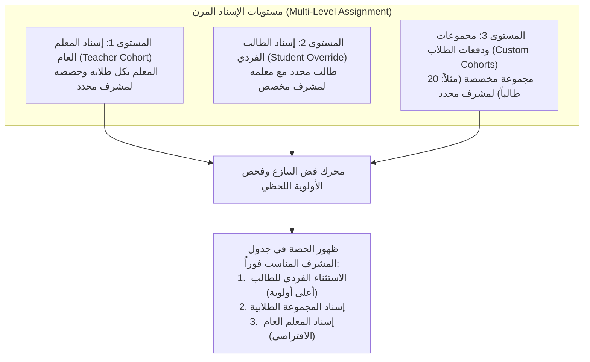

# خطة التطوير الشاملة: ترقية منظومة الإشراف وتوحيد معايير الـ UI/UX
## الوثيقة المرجعية الرسمية: V3-9.1 (Master Plan)

---

## 1. المقدمة والهدف الاستراتيجي

تهدف هذه الوثيقة إلى وضع خارطة طريق هندسية وتصميمية متكاملة للارتقاء بكافة لوحات التحكم الإشرافية الجديدة في **ترتيلة أونلاين**، وتحويلها من شكلها التجريبي الحالي إلى مساحات عمل احترافية متكاملة تتطابق بنسبة 100% مع المستوى البصري والتشغيلي الرفيع لـ **لوحة المعلم** و**لوحة الأدمن**.

كما تهدف الخطة إلى حل الثغرات الهيكلية في محرك الإسناد، وتوفير مرونة تشغيلية قصوى تشمل إسناد المعلمين، والطلاب الفرديين، والمجموعات/الدفعات الطلابية المخصصة، مع ربط كل ذلك بالملفات الشخصية للمعلمين والطلاب في كامل المنصة.

---

## 2. تقييم الفجوة البصرية والتشغيلية (The Visual Benchmark)

بالمقارنة البصرية المباشرة بين لوحات المنصة:
- **لوحة المعلم والأدمن (المعيار المعتمد):**
  - شريط جانبي مخصص (Dedicated Sidebar) بأقسام واضحة، أيقونات راقية، وشارات تنبيه حية.
  - قسم رئيسي حيوي (Hero Widget) يتضمن عداداً تنازلياً للحصة القادمة أو شريطاً للمهام العاجلة.
  - 4 كروت إحصائيات بيضاء (KPIs) بأيقونات ملونة ناعمة وأرقام واضحة بالإنجليزية (0-9).
  - كروت إجراءات سريعة ملونة (Quick Actions) تتيح الوصول لأهم الوظائف بنقرة واحدة.
  - جدول عمليات أنيق مع إجراءات منبثقة بنظام الأدراج الجانبية (Slide-over Panels) دون تشتيت الصفحة.
- **شاشة الإشراف الحالية (المطلوب نسفها وإعادة بنائها):**
  - اختفاء تام للشريط الجانبي (Sidebar) وتفريغ الشاشة من الهيكل الإداري.
  - كتلة بنفسجية صلبة وميتة كبانر إعلاني قديم لا وظيفة له.
  - تكديس 13-14 زر تبويب أفقي في سطرين بشكل مشتت ومرهق بصرياً.
  - خلو الواجهة من بطاقات الـ KPIs أو أزرار الإجراءات السريعة، واعتماد قوائم نصية مسطحة ميتة.

---

## 3. المحور الأول: محرك الإسناد المرن الشامل (The 3-Tier Assignment Engine)

التحول من نظام الإسناد الأحادي الجامد (معلم ← مشرف فقط) إلى محرك إسناد ثلاثي الأبعاد فائق المرونة:

### تفاصيل المستويات:

#### أ. المستوى الأول: إسناد المعلم العام (Teacher Cohort - الافتراضي)
- يسند المعلم (أحمد) إلى المشرف (خالد).
- **النتيجة:** جميع الحصص والطلاب التابعين لأحمد تظهر تلقائياً في شاشة خالد، ما لم يوجد استثناء صريح.

#### ب. المستوى الثاني: إسناد الطالب الفردي (Student Override)
- الطالب (عمر) يدرس مع المعلم (أحمد).
- نظراً لاحتياج الطالب (عمر) لمتابعة خاصة، يتم إنشاء استثناء لإسناد حصص (عمر مع أحمد) للمشرف (ياسر).
- **النتيجة:** حصة عمر تظهر عند ياسر فقط، وباقي حصص المعلم أحمد تظل عند خالد.
- **معالجة تعدد المعلمين:** إذا كان عمر يدرس أيضاً مع المعلم (محمود)، فإن إسناده مع أحمد لا يؤثر على حصصه مع محمود، بحيث تظل كل علاقة تدريس مستقلة بدقة.

#### ج. المستوى الثالث: نظام المجموعات والدفعات المخصصة (Custom Cohorts Hub)
- إنشاء موديل جديد في قاعدة البيانات: `SupervisionCohort`:
  - `name`: اسم المجموعة (مثل: "دفعة أبطال التجويد - مسائي").
  - `team`: أكاديمي / إداري.
  - `supervisorId`: المشرف المسؤول عن المجموعة.
  - `studentIds`: قائمة الطلاب المضافين للمجموعة (Array of User IDs).
  - `createdBy`, `notes`, `isActive`, `history`.
- **العمليات المدعومة على المجموعة بالكامل (Full CRUD):**
  - إنشاء مجموعة جديدة وإضافة أي عدد من الطلاب إليها (حتى لو كانوا من معلمين مختلفين).
  - إضافة طلاب جدد للمجموعة أو حذف طلاب منها بنقرة زر.
  - إعادة تعيين المجموعة لمشرف جديد بضغطة زر مع حفظ سجل المشرف السابق.
  - تفعيل أو تعطيل المجموعة.

#### د. خوارزمية فض النزاع وقواعد الحالات الحدية (Edge Cases):
1. **أولوية الحصة في حلقات اليوم:**
   - **المرتبة الأولى:** التكليف الفردي للطالب (`Student Override`).
   - **المرتبة الثانية:** تكليف المجموعة الطلابية (`Cohort Assignment`).
   - **المرتبة الثالثة:** تكليف المعلم العام (`Teacher Cohort`).
2. **منع التكرار:** لا يمكن إضافة الطالب لأكثر من مجموعة نشطة واحدة في نفس الفريق (الأكاديمي أو الإداري).
3. **تغيير المشرف أثناء الشيفت:** يتم حفظ التكليف السابق كـ `closed` مع تسجيل الطابع الزمني، ويبدأ التكليف الجديد فوراً دون فقدان أي تقارير سابقة.
4. **الفصل الصارم:** المسار الأكاديمي والمسار الإداري مساران متوازيان ومستقلان تماماً في قاعدة البيانات (`academicAssignment` و `administrativeAssignment`).

---

## 4. المحور الثاني: هندسة الواجهات للوحات الإشراف الأربع المستقلة (Dedicated Workspaces)

إلغاء صفحة `AdminSupervisionPage.jsx` المجمعة الحالية، وبناء 4 مساحات عمل مستقلة تماماً:

---

### 1. لوحة المشرف الأكاديمي (`/admin/supervision/academic`)
*شاشة مخصصة للمتابعة الميدانية لجودة الحلقات وتلاوة القرآن.*

- **الشريط الجانبي المخصص (Sidebar):**
  - الرئيسية (نظرة عامة والتركيز اليومي).
  - حلقات اليوم (جدول الحصص الميدانية الجارية والقادمة).
  - تقارير المتابعة R1 (مسوداتي والتقارير المرفوعة).
  - الطلاب والمناهج (الخطط ومراحل حفظ وتجويد الطلاب المسندين).
  - التوجيهات الأكاديمية (التعليمات الموجهة من المدير مع زر تأكيد القراءة).
  - المعلمون والطلاب المسندون لي.
  - الإعدادات والشيفتات.
- **قسم البداية التفاعلي (Hero Section):**
  - بطاقة عريضة تشبه بطاقة الحصة القادمة في لوحة المعلم:
    - عنوان الحصة والمنهج + اسم الطالب واسم المعلم.
    - عداد تنازلي حي للوقت المتبقي.
    - **زر أساسي بنفسجي:** `دخول الحلقة عبر Meet` يفتح رابط Google Meet في تبويب جديد.
    - **زر أبيض بجانبه:** `رصد تقرير المتابعة R1 فوري` يفتح الدرج الجانبي لتعبئة التقرير لحظياً.
- **كروت المؤشرات الحية (KPI Cards):**
  - حلقات اليوم المجدولة تحت متابعتي.
  - الحلقات المراقبة فعلياً اليوم.
  - تقارير R1 المكتملة.
  - إجمالي الطلاب المسندين لي.
- **كروت الإجراءات السريعة (Quick Action Cards):**
  - [رصد ملاحظة عامة] - [تحديث مرحلة منهج طالب] - [طلب اجتماع مع معلم] - [استفسار لمدير الإشراف].
- **جدول حلقات اليوم التفاعلي:**
  - عرض الحصص مقسمة حسب الفترات (صباحي / مسائي).
  - شارات الحالة الحية (لم تبدأ / جارية / انتهت).
  - زر مباشر لكل حصة يفتح درج التفاصيل (Slide-over Drawer بعرض 460px).

---

### 2. لوحة مدير الإشراف الأكاديمي (`/admin/supervision/academic-manager`)
*شاشة قيادية للاعتماد، توزيع التكليفات، ومتابعة الأداء العام.*

- **الشريط الجانبي المخصص (Sidebar):**
  - الرئيسية (نبض الإشراف الأكاديمي).
  - صندوق الاعتمادات (مراجعة واعتماد تقارير R1 المرفوعة من المشرفين).
  - محرك التكليفات والمجموعات (إدارة إسناد المعلمين، الطلاب، ومجموعات الدفعات).
  - المناهج والخطط الأكاديمية (متابعة سير المناهج لكافة طلاب الأكاديمية).
  - التوجيهات والتعاميم (مركز بث التوجيهات لجميع المعلمين والمشرفين).
  - التقارير الدورية (مؤشرات الأداء R3 الأسبوعية و R4 الشهرية).
  - فريق المشرفين الأكاديميين (إدارة حساباتهم ومناوباتهم).
- **قسم البداية التفاعلي (Hero Section):**
  - شريط تنبيه المهام المعلقة المشابه للوحة الأدمن:
    - [عدد] تقارير R1 بانتظار المراجعة والاعتماد.
    - [عدد] طلاب بدون خطة أكاديمية معتمدة.
    - [عدد] تكليفات تنتهي هذا الأسبوع تحتاج تجديداً.
- **مركز اعتمادات تقارير R1:**
  - جدول تقارير المشرفين المرفوعة مع فلترة فورية.
  - النقر على أي تقرير يفتح الدرج الجانبي: يعرض تقييم المشرف، ملاحظاته، ونقاط التحسين، مع 3 أزرار قرار واضحة: `اعتماد التقرير`، `طلب تعديل من المشرف`، أو `إضافة توجيه إداري`.
- **مركز المجموعات والتكليفات (Cohort & Assignment Hub):**
  - واجهة مرئية سهلة تمكن المدير من إنشاء مجموعات طلابية بضغطة زر، وإسنادها، وإجراء الاستثناءات الفردية.

---

### 3. لوحة المشرف الإداري (`/admin/supervision/administrative`)
*غرفة العمليات الميدانية للانضباط، الحضور والغياب، والتعامل مع الطوارئ.*

- **الشريط الجانبي المخصص (Sidebar):**
  - غرفة العمليات الحية (Live Operations Desk).
  - حالات اليوم (التأخيرات، غياب المعلمين، غياب الطلاب).
  - طلبات الاعتذار والتعويضات.
  - مطابقة المعلم البديل الفوري (Substitute Quick Match).
  - شيفتي وتسليم المناوبة (Handoff Log).
- **قسم البداية التفاعلي (Hero Section):**
  - **رادار العمليات اللحظي:** شريط مراقبة حي ينبه فوراً عند مرور 5 دقائق على موعد حلقة مجدولة دون إعلان المعلم بدء الحصة، مع زر سريع `تعيين معلم بديل فوري`.
- **كروت المؤشرات الحية (KPI Cards):**
  - حصص الشيفت الحالي.
  - نسبة الحضور المثبت لحظياً.
  - الاعتذارات المسجلة اليوم.
  - الحالات العالقة التي تتطلب تدخلاً.
- **مركز معالجة الاعتذارات والتعويضات:**
  - نموذج ذكي يتيح تسجيل اعتذار الطالب أو المعلم، وتحويل الحصة إلى رصيد تعويضي أو جدولة موعد بديل بضغطة زر.

---

### 4. لوحة مدير الإشراف الإداري (`/admin/supervision/administrative-manager`)
*شاشة إدارة الشيفتات، الانضباط العام، والقرارات المالية.*

- **الشريط الجانبي المخصص (Sidebar):**
  - مركز القرارات والتسويات (طلبات الخصم والمكافآت المرفوعة لرواتب المعلمين).
  - إدارة الشيفتات والمناوبات (جدولة وتوزيع المشرفين الإداريين على مدار 24 ساعة).
  - مؤشرات الانضباط التشغيلي ونسب الحضور العامة.
  - سياسات التعويضات والغياب.
- **مركز القرارات والتسويات المالية:**
  - جدول بطلبات التعديل المالي المرفوعة من المشرفين الإداريين بسبب غياب أو تأخر معلم.
  - صلاحية البت الفوري لمدير الإشراف الإداري: `اعتماد الخصم / المكافأة` (ليُسجل فوراً وبشكل رسمي في مسير الرواتب `TeacherPayrollEntry`)، أو `رفض الطلب مع بيان السبب`.

---

## 5. المحور الثالث: التكامل الشامل مع الملفات الشخصية (360° Profile Visibility)

ربط الإشراف بملفات المعلمين والطلاب لإنهاء ظاهرة "الجزر المعزولة":

### أ. في الملف الشخصي للمعلم (`AdminTeacherProfilePage`):
1. **بطاقة الإشراف في أعلى الصفحة (Header Card):**
   - **المشرف الأكاديمي المسؤول:** اسم المشرف مع صورته وتاريخ بدء التكليف.
   - **المشرف الإداري للمناوبة:** اسم المشرف الإداري المسؤول.
   - **زر إجراء سريع:** `تغيير المشرف الأكاديمي` بنقرة واحدة من داخل الملف الشخصي.
2. **تبويب مخصص جديد: "تقارير الإشراف والمتابعة":**
   - أرشيف تقارير المتابعة R1 الخاصة بحصص هذا المعلم.
   - سجل تقييمات المشرفين لمستوى أدائه والتزامه بالمنهج.
   - التوجيهات الأكاديمية الصادرة له وسجل اطلاعه عليها.

### ب. في الملف الشخصي للطالب (`AdminStudentDetailPage`):
1. **بطاقة الإشراف:**
   - **المشرف الأكاديمي المسؤول:** [اسم المشرف الأكاديمي].
   - **المجموعة المسند إليها:** [اسم المجموعة / الدفعة إن وجد].
   - **زر إجراء سريع:** `إسناد لمجموعة / تغيير المشرف`.
2. **تبويب مخصص جديد: "الخطة والمنهج الأكاديمي":**
   - الخطة التعليمية المعتمدة للطالب ومساره (حفظ، تجويد، تلقين).
   - المراحل المنجزة في المنهج (Milestones) وتاريخ إتمام كل جزء.
   - ملاحظات المشرف الأكاديمي على نطق ومخارج حروف الطالب.

---

## 6. المحور الرابع: هيكلية القائمة الجانبية للأدمن ونظام الصلاحيات الجاهزة

### أ. في القائمة الجانبية للأدمن العام (`AdminLayout.jsx`):
- **إلغاء:** عنصر "الإشراف" الموحد والمشوش.
- **إضافة قسمين صريحين ومنفصلين:**
  - 🎓 **الإشراف الأكاديمي** (يفتح مساحة العمل الأكاديمية المتكاملة بكافة وظائفها).
  - 📋 **الإشراف الإداري** (يفتح غرفة العمليات والتسويات الإدارية).

### ب. نظام الصلاحيات الموحد بالأدوار الجاهزة (Preset 8 Roles):
- عند إضافة أو تعديل أي موظف أو مشرف في صفحة إدارة الفريق (`AdminAdminsPage`):
  - يختار الأدمن **الدور الوظيفي المعتمد** من قائمة منسدلة واضحة:
    1. الأدمن العام (Primary Admin).
    2. مدير الإشراف الأكاديمي (Academic Manager).
    3. مشرف أكاديمي (Academic Supervisor).
    4. مدير الإشراف الإداري (Administrative Manager).
    5. مشرف إداري (Administrative Supervisor).
    6. موظف العمليات والدعم (Operations & Support).
    7. معلم (Teacher).
    8. طالب (Student).
  - النظام يقوم في الخلفية بتعيين حزمة الصلاحيات الدقيقة فوراً، مع إخفاء قائمة الـ 67 Checkbox تماماً لتجربة مستخدم سريعة وخالية من الأخطاء.

---

## 7. معايير الهوية البصرية والتصميم (Mastercraft UI/UX Rules)

لضمان خروج الواجهات بنفس فخامة واجهات Linear و Stripe:
1. **إعدام البانرات الملونة الغامقة:**
   - اعتماد الخلفية الرمادية الفائقة النعومة (`#F8FAFC`) مع بطاقات بيضاء ناصعة (`#FFFFFF`) وحدود رمادية خفيفة (`border-slate-200`) وظلال هادئة (`shadow-sm`).
2. **نظام الأدراج الجانبية (Slide-over Panels):**
   - أي تفاصيل لحصة، أي تعديل لتكليف، أو كتابة تقرير متابعة R1، يفتح في درج جانبي منزلق بعرض 460px من جهة اليمين (RTL) دون مغادرة الصفحة أو إزاحة محتوياتها.
3. **أرقام لاتينية دولية (0-9):**
   - التزام صارم بالأرقام الإنجليزية في كافة الجداول، العدادات، والبطاقات الإحصائية.
4. **التوافق الكامل مع RTL والعربية:**
   - ضبط الهوامش المنطقية (`ms-` و `me-`) واتجاه الأيقونات بدقة.

---

## 8. مراحل التنفيذ التفصيلية (Implementation Roadmap)

| المرحلة | نطاق العمل الفني | المخرجات الرئيسية |
| :--- | :--- | :--- |
| **المرحلة 1: البنية الخلفية وقواعد البيانات (Backend)** | • إنشاء موديل `SupervisionCohort` للمجموعات الطلابية. • توسيع موديل `SupervisionAssignment` لدعم الطالب الفردي والمجموعات. • بناء محرك فض النزاع وتوليد حصص المشرف وفق الأسبقية. • إضافة مسارات الـ API للـ CRUD الخاص بالمجموعات. | محرك إسناد مرن متكامل ومختبر بـ Unit Tests جديدة. |
| **المرحلة 2: إطار الواجهات المشترك (Layout & Sidebars)** | • بناء هيكل `SupervisionLayout` العام المشابه لـ `TeacherLayout` و `AdminLayout`. • برمجة السايدبار المخصص لكل دور إشرافي مع شارات التنبيه الحية. • بناء مكونات Hero و KPIs و Quick Actions المشتركة. | هيكل بصري فخم ومستقل لكل دور إشرافي. |
| **المرحلة 3: لوحات الإشراف الأكاديمي (Supervisor & Manager)** | • بناء شاشة المشرف الأكاديمي (العداد التنازلي + زر الدخول + تقرير R1 المباشر). • بناء شاشة مدير الإشراف الأكاديمي (صندوق الاعتمادات + إدارة المجموعات والتوجيهات). • بناء Slide-over Drawers لتقارير المتابعة وتفاصيل الحلقات. | واجهات إشراف أكاديمي مكتملة ومطابقة لأعلى معايير التصميم. |
| **المرحلة 4: لوحات الإشراف الإداري (Supervisor & Manager)** | • بناء غرفة العمليات الحية للمشرف الإداري (رادار التأخيرات + المعلم البديل). • بناء مركز قرارات التعديلات المالية لمدير الإشراف الإداري. • إدارة ومناوبات الشيفتات على مدار 24 ساعة. | واجهات إشراف إداري تشغيلية ومالية منضبطة. |
| **المرحلة 5: الربط الكامل بالملفات الشخصية (Profile Integration)** | • إضافة بطاقة الإشراف وتبويب التقارير في صفحة المعلم (`AdminTeacherProfilePage`). • إضافة بطاقة الإشراف وتبويب المنهج في صفحة الطالب (`AdminStudentDetailPage`). | تكامل شامل 360 درجة عبر كامل المنصة. |
| **المرحلة 6: هيكلة القائمة الجانبية والصلاحيات الجاهزة** | • تحديث `AdminLayout.jsx` بفصل الإشراف الأكاديمي عن الإداري. • تبسيط شاشة إدارة الفريق في `AdminAdminsPage` بنظام الأدوار الجاهزة (Preset Roles). | إدارة مبسطة ومباشرة للفرق والصلاحيات. |
| **المرحلة 7: الاختبارات والتحقق الشامل (Quality Assurance)** | • تشغيل كامل اختبارات السيرفر والواجهة للتأكد من تخطيها 100%. • فحص تجربة المستخدم على الشاشات المختلفة (Desktop / Tablet / Mobile). | جاهزية تامة للنشر والإنتاج بأعلى معايير الجودة. |

---

## 9. معايير القبول والتسليم (Definition of Done)

تعتبر هذه الخطة منجزة بنجاح عند تحقق الشروط التالية:
1. قدرة مدير الإشراف على إنشاء مجموعة طلابية من 20 طالباً وإسنادها لمشرف بنقرة واحدة، وتعديلها في أي وقت.
2. قدرة الإدارة على إسناد طالب محدد مع معلمه لمشرف خاص وتخطي التكليف العام بنجاح.
3. ظهور رابط Google Meet وزر رصد تقرير R1 الفوري في بطاقة كل حصة في حلقات اليوم.
4. تطابق الهوية البصرية للوحات الإشراف الأربع مع لوحة المعلم والأدمن (سايدبار أنيق، خلفية رمادية فاتحة، أدراج جانبية، صفر بانرات غامقة).
5. ظهور بيانات الإشراف كاملة داخل الملف الشخصي لكل معلم ولكل طالب.
6. نجاح اختبارات البناء `npm run build` واختبارات السيرفر `npm test` بنسبة 100% دون أي خطأ.

---

## 10. سجل التنفيذ الفعلي

- [x] الإسناد المؤرخ للمعلم والطالب مع معلمه والمجموعة مع أولوية واضحة ومنع تضارب العضوية النشطة.
- [x] تطبيق الملكية الفعلية على القوائم والتقارير والإحصاءات والتنبيهات وتسليم الشيفت قبل التصفح.
- [x] إنشاء المجموعات وتعديل عضويتها وإغلاقها وإسنادها لمشرف أثناء إنشائها أو تبديله لاحقًا.
- [x] أربع واجهات إشراف موجهة للدور، مع قوائم جانبية مستقلة حسب الصلاحية ومؤشرات وحصة قادمة وإجراء R1 أو متابعة التأخير.
- [x] ربط ملفات المعلم والطالب الإدارية بالمشرفين والمجموعات والتقارير والخطط الموجودة.
- [x] فصل الإشراف الأكاديمي والإداري في قائمة الأدمن وتبسيط عرض صلاحيات الموظف.
- [x] اختبار API فعلي على Mongo محلي للإسناد المتدرج وصلاحياته، واختبارات وحدات وبناء العميل.
- [x] المراجعة البصرية التفاعلية على سطح المكتب والجوال والتنقل بحسابات الأدوار الأربعة والأدمن والدرج ولوحة المفاتيح.
- [x] حماية نطاق الحالات عند غياب التكليفات ومسح البيانات المؤقتة عند تبديل الحساب، مع اختبارات رجوع.
- [ ] قبول أصحاب المنصة التشغيلي والنشر.

التحقق النهائي بتاريخ 2026-09-30: نجحت 693/693 اختبارات الخادم في 72 مجموعة، و100/100 اختبارات الواجهة، والبناء وفحص التنسيق المستهدف وإحدى عشرة مجموعة تحقق على Mongo معزول. التجربة المحلية جاهزة للمراجعة؛ لم تحفظ تجربة المتصفح سجلات تجريبية في قاعدة التشغيل.

قرار الدمج: استُخدم `AdminLayout` القائم للّوحات الأربع مع قوائم خاصة بكل دور، وحُفظت أقسام التشغيل الحالية كواجهات داخل كل لوحة بدل إعادة كتابتها بنظام موازٍ. إنشاء المجموعة وإسنادها إجراء واحد للمستخدم وخطوتان مستقلتان في الخادم؛ عند فشل الثانية تظهر المجموعة بلا إسناد واضح يمكن إكماله. لم تُبنَ رتب رقمية أو رصد حضور Zoom/Meet أو أتمتة جروبات واتساب ضمن V3-9.1.
