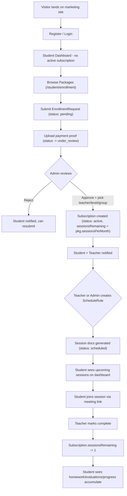
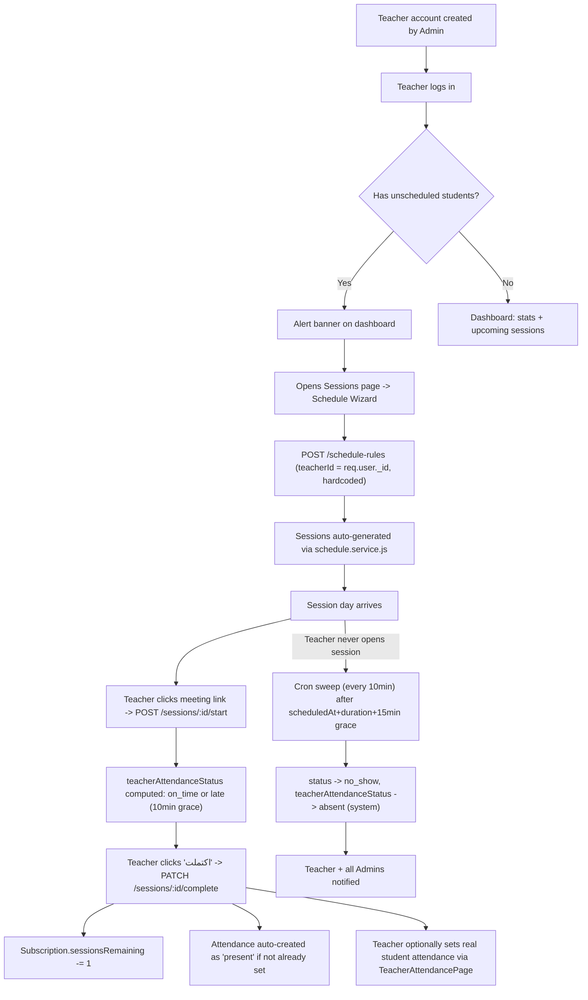
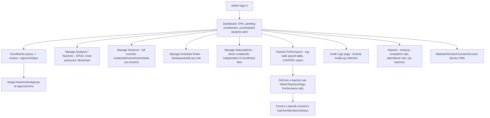
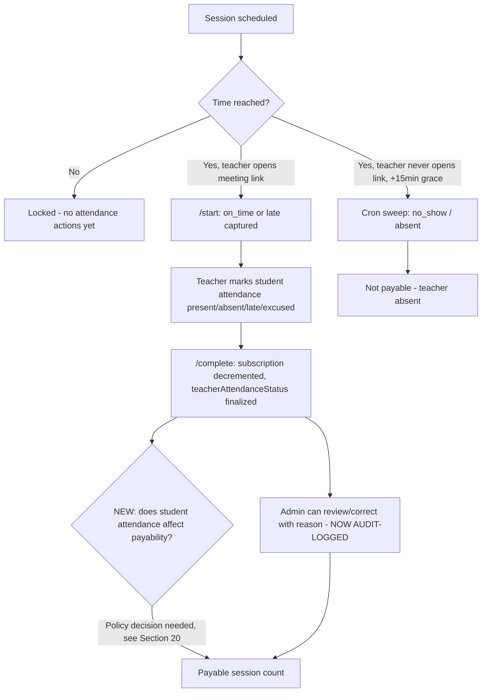
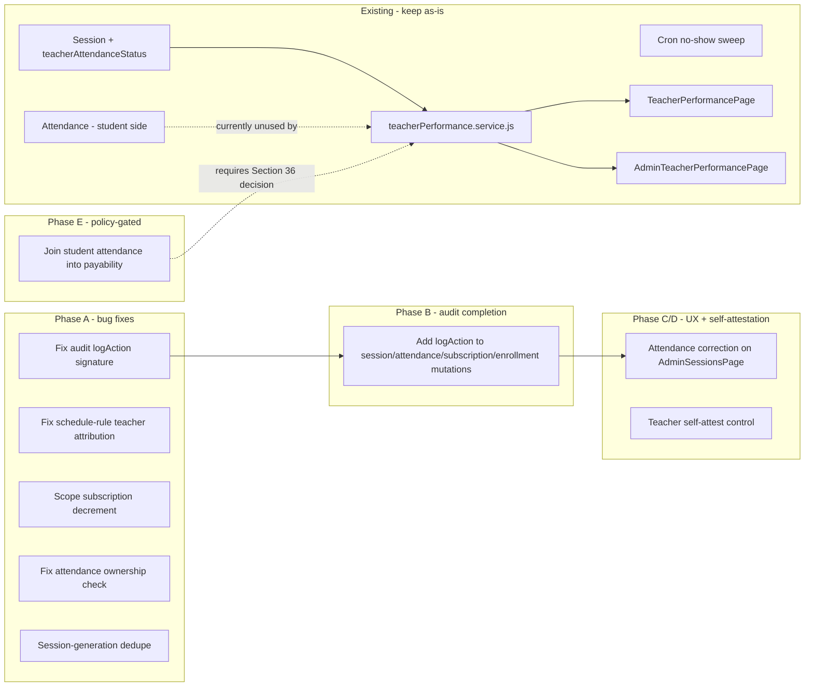

# Platform Flow & Teacher Attendance/Payroll Plan

**Status:** Phase 1 (Reverse Engineering) + Phase 2 (Planning) — awaiting explicit approval before any code is written.
**Scope of this document:** Reconstructs the *actual* Tartelah Online platform from the real codebase (not from ARCHITECTURE_PLAN.md's original aspirational design, which diverges from what was actually built in several places — noted inline), then proposes a plan for the teacher attendance/payroll feature the management team needs.
**Method:** Direct file reads of every model/controller/route/service on the backend and every relevant page/service on the frontend, cross-checked against git status. All claims below are cited with `file:line`.

---

# 1. Executive Summary

**The most important finding: most of what this task asked to design already exists in the codebase, working end-to-end.**

There is a complete teacher-attendance-and-salary subsystem already built and shipped:

- `Session.teacherAttendanceStatus` (`pending/on_time/late/absent/excused`) is computed automatically from real timestamps — when a teacher clicks the meeting-link ("start"), on completion, or by a cron job that sweeps stale sessions every 10 minutes and marks unattended ones `no_show`/`absent`.
- `teacherPerformance.service.js` computes, live from `Session` records (no duplicated/stale stats table), a full salary breakdown: payable sessions × `User.salaryPerSession`, punctuality/completion rates, weekly/monthly trends, and an org-wide payroll report.
- Two fully-built, fully-routed frontend pages already expose this: `TeacherPerformancePage.jsx` (teacher's own salary/attendance, with CSV+PDF export) and `AdminTeacherPerformancePage.jsx` (org-wide payroll table, with CSV+PDF export), both linked from their respective sidebars.
- An admin can manually correct a specific session's teacher-attendance status via a dedicated endpoint.
- A full `AuditLog` model + read API + admin UI (`AdminAuditLogsPage.jsx`, `/admin/audit-logs`) already exists.

**So why does management feel like they can't answer "how many payable sessions did this teacher teach this month"?** Because the existing system, while structurally sound, has real gaps that undermine trust in its numbers:

1. **Payability never checks student attendance.** A session counts as payable purely from the teacher's own self-reported timing (`on_time`/`late`), even if the *student* was separately marked `absent` in the unrelated `Attendance` model. This is the single biggest open policy question (see §15, §20).
2. **The audit trail is almost entirely non-functional.** The infrastructure exists (model, service, admin UI) but the only controller with a complete set of call sites (`article.controller.js`) calls the logging function with the wrong argument shape, so every call silently fails validation and writes nothing. Only two working call sites exist anywhere in the codebase (`admin.controller.js`, student update/deactivate). None of the session, attendance, subscription, or enrollment-approval flows — the ones that actually matter for payroll trust — are audited at all (see §14, §29).
3. **The admin correction workflow is hard to find** — it lives inside the teacher-profile page's "Performance" tab, not on the main Sessions management page where an admin would naturally look for it.
4. **No explicit teacher self-attestation step** exists distinct from system-inferred timing — Phase 5/8 of this task's brief asks for a "confirm I taught this" action; today that confirmation is entirely implicit (clicking "start"/"complete") with no separate notes-taking moment tied to attendance specifically (notes exist on the session generally, but not as part of a submit-attendance ritual).
5. Several smaller integrity gaps: no dedupe protection when regenerating recurring sessions, a subscription-decrement query that doesn't scope to the specific subscription, two independent and unsynchronized "who is this student's teacher" fields, and an admin-created schedule rule silently attributing itself to the admin instead of the actual teacher.

**Recommended framing for the rest of this document:** this is **not** a "build attendance/payroll from scratch" project. It is a **hardening and completion** project — close the specific gaps above, fix the two concrete bugs (audit call signature, admin schedule-rule teacher attribution), decide the one big open policy question (does student absence affect teacher pay), and consolidate the admin UX so the correction/audit tools are where admins will actually find them.

---

# 2. Current Platform Architecture

**Frontend:** React 18 + Vite, TailwindCSS, React Router v6, TanStack React Query v5, Zustand, Framer Motion, Axios. All pages are lazy-loaded (`React.lazy`) under a single top-level `<Suspense>` in `App.jsx`, with per-layout `<ErrorBoundary>`/`<Suspense>` scoping added to `TeacherLayout` (not yet Admin/Student — see [[project_suspense_routing_bug]] memory).

**Backend:** Node.js + Express, MongoDB + Mongoose, JWT (access token in response body / held client-side, refresh token in an httpOnly cookie), bcrypt, multer (local disk uploads), node-cron (3 jobs), nodemailer.

**Note on ARCHITECTURE_PLAN.md divergence:** The original plan (`ARCHITECTURE_PLAN.md`) specified separate `StudentProfile`/`TeacherProfile` models and a `ClassSession` model. **Neither was built.** The live system keeps everything flat on a single `User` model (`role` enum `admin/teacher/student`) and uses a `Session` model (not `ClassSession`) that evolved well beyond the original plan (recurring series via `ScheduleRule`, teacher punctuality tracking, etc.). Treat `ARCHITECTURE_PLAN.md` as historical intent, not current truth — this report reflects the actual code.

**API base:** `/api/v1`, mounted route-by-route in `server/src/routes/index.js:1-26`:

```
/auth  /users  /students  /teachers  /sessions  /attendance  /evaluations
/homework  /memorization  /revision  /subscriptions  /notifications
/courses  /packages  /admin  /website  /ai  /enrollments  /schedule-rules
/articles  /success-stories  /teacher-performance
```

---

# 3. Current Roles and Permissions

Three roles, flat on `User.role` (`models/User.js:11`): `admin`, `teacher`, `student`. No `parent` role exists anywhere in the codebase.

**RBAC mechanism** (`middleware/rbac.middleware.js`, 19 lines total):
```js
function authorize(...roles) {
  return (req, res, next) => {
    if (!req.user) return res.status(401)...
    if (!roles.includes(req.user.role)) return res.status(403)...
    next()
  }
}
const isAdmin = authorize('admin')
const isTeacher = authorize('admin', 'teacher')       // NOTE: identical to isAdminOrTeacher
const isStudent = authorize('student')
const isAdminOrTeacher = authorize('admin', 'teacher')
```
`isTeacher` and `isAdminOrTeacher` are literally the same guard — a naming footgun (a route guarded by "isTeacher" does **not** exclude admins, and does not mean "the resource belongs to this teacher"). **There is no generic ownership-check middleware anywhere.** Every "teacher can only touch their own X" check is hand-rolled per controller action (e.g. `session.teacherId.toString() !== req.user._id.toString()` repeated in `session.controller.js`, `attendance.controller.js`, `evaluation.controller.js`, `homework.controller.js`). This is inconsistently applied — see §14 gap on `attendance.controller.updateAttendance` having no ownership check at all.

**Auth flow** (`middleware/auth.middleware.js`): `authenticate` reads `Authorization: Bearer <token>`, verifies via `config/jwt.js`, loads the full `User` document (minus password/refreshToken) onto `req.user`, rejects if missing or `isActive:false`. `optionalAuth` is the same but swallows errors (used for public+enhanced endpoints). Access token: 15m default; refresh token: 7d, httpOnly cookie, single-use-not-rotated on refresh.

A dev-only backdoor exists (`auth.controller.js` `devLogin`) that instantly logs in as any role with no password — hard-blocked when `NODE_ENV === 'production'` (double-guarded per [[project_tartelah]] memory).

---

# 4. Current Student End-to-End Flow



Student-facing pages (all confirmed routed in `App.jsx:136-149`): Dashboard, Schedule, Sessions, Homework, Evaluations, Progress, Academic Record, Subscription, Enrollment, Notifications, Settings.

Notable: `StudentAcademicPage` (`/student/academic-record`) reads from the `Enrollment` model (course-progress), which — per §9 — is **effectively orphaned in production** (nothing ever writes to it outside the seed script). This page will show empty/stale data for any student who wasn't part of the original seed.

---

# 5. Current Teacher End-to-End Flow



Teacher-facing pages (`App.jsx:151-164`): Dashboard, Students, Sessions, Attendance (student attendance, separate concept — see §13), Evaluations, Homework, Progress, Meeting Links, **Performance** (`/teacher/performance` — salary & attendance, fully built), Notifications, Settings.

Key nuance: punctuality capture is **coupled to whether the teacher clicks the "join meeting" button**, because `/start` only fires from that click handler (`TeacherSessionsPage.jsx:243-246`). If a teacher completes a session without ever clicking join, punctuality falls back to inference from the completion timestamp (`session.controller.js:164-169`) — a weaker, more gameable signal, though this is an inherent limitation given the platform stores only external meeting links (no video integration, explicitly out of scope per `SCOPE_OF_WORK.md`).

---

# 6. Current Admin End-to-End Flow



Admin pages (`App.jsx:167-191`): Dashboard, Students (+ detail), Teachers, Courses (+ form), Sessions, Schedule Rules, Packages, Subscriptions, Enrollments, Website, Reports, Notifications, **Audit Logs**, Settings, Articles (+ editor), Contact Messages, Success Stories, **Teacher Performance**.

Admin has full override authority on nearly everything (`admin.routes.js` gates the entire router with `isAdmin`), consistent with `FEATURE_TRACKER.md`'s "Admin session ownership bypass" fix noted for 2026-06-24.

---

# 7. Parent Flow

**Not applicable — no `parent` role exists anywhere** in `User.role` enum, routes, or frontend. Confirmed by the role enum (`models/User.js:11`: `['admin', 'teacher', 'student']`) and no `parent`-related route/page found in any of the three research passes. Skip this phase; flag it as future scope only if the business ever requests it.

---

# 8. Current Subscription and Approval Flow

This is the most consequential business logic in the platform and the direct upstream of the payroll problem.

**Two enrollment-shaped models exist; only one is live:**

| Model | Status | Purpose |
|---|---|---|
| `EnrollmentRequest.js` | **Live** — backs the entire `/api/v1/enrollments/*` API | Payment/admission workflow: `pending → under_review → approved/rejected` |
| `Enrollment.js` | **Orphaned** | Course-progress tracking (`courseId`, `progressPercent`). No controller ever writes to it at runtime — only `seed/seed.js` populates it. `student.controller.getMyAcademic` (`/students/me/academic`) reads from it, so that page will be empty for any non-seeded student. |

**`EnrollmentRequest` schema** (`models/EnrollmentRequest.js:3-33`): `studentId`, `packageId`, `status` (pending/under_review/approved/rejected), `paymentMethod`, `paymentReference`, `paymentProofUrl`, `amount`, `studentNotes`, `adminNotes`, `teacherId`/`levelId`/`groupName` (set only on approval), `reviewedBy`, `reviewedAt`, `subscriptionId` (set only on approval). Business rule enforced in code: max one `pending`/`under_review` request per student at a time (`enrollment.controller.js:21-25`).

**Approval logic** (`enrollment.controller.js:159-225`, exact excerpt):
```js
if (action === 'approved') {
  if (!teacherId) return sendError(res, 'يجب تحديد المعلم عند الموافقة', 400)
  request.teacherId = teacherId; request.levelId = levelId; request.groupName = groupName
  const end = new Date(start.getTime() + (pkg.durationDays || 30) * 24*60*60*1000)
  const subscription = await Subscription.create({
    studentId: request.studentId._id, packageId: pkg._id, teacherId,
    startDate: start, endDate: end,
    sessionsRemaining: pkg.sessionsPerMonth, totalSessions: pkg.sessionsPerMonth,
    amountPaid: request.amount, status: 'active', notes: adminNotes, createdBy: req.user._id,
  })
  request.subscriptionId = subscription._id
  // notify student + notify teacher
}
```
The admin **must** explicitly pick the teacher at approval time — there is no auto-assignment logic. No `Session`/`ScheduleRule` is created here; that is a separate, later manual step (§9). No audit log entry is written for this action (§14, §29 gap).

**Subscription model** (`models/Subscription.js:3-32`): `studentId`, `teacherId`, `packageId`, `courseId`, `status` (pending/active/expired/cancelled/paused), `startDate`, `endDate`, `sessionsRemaining`, `totalSessions`, `amountPaid`, `createdBy`. Pre-save hook clamps `sessionsRemaining` to never go negative.

**`sessionsRemaining` decrement — single site, confirmed by grep:** only `session.controller.completeSession` (`session.controller.js:171-174`):
```js
await Subscription.findOneAndUpdate(
  { studentId: session.studentId, status: 'active' },
  { $inc: { sessionsRemaining: -1 } }
)
```
This matches by `studentId + status:'active'` **without** scoping to `session.subscriptionId`. The schema does not prevent a student from having more than one `active` subscription simultaneously — if that ever happens, the wrong subscription could be decremented. Flagged as a gap (§30).

Subscriptions can *also* be created directly by an admin (`POST /subscriptions`, bypassing the enrollment-request flow entirely) or edited via `PATCH /subscriptions/:id` (whitelisted fields including `teacherId` — a second place teacher assignment can change).

---

# 9. Current Scheduling / Session Flow

**Teacher assignment has two independent, unsynchronized sources of truth:**

1. **`Subscription.teacherId`** — the billing-level assignment, set at enrollment approval or via admin subscription edit. This is what `teacher.controller.getMyStudents` uses to build a teacher's roster (`Subscription.find({teacherId, status:'active'})`).
2. **`ScheduleRule.teacherId` + `ScheduleRule.studentId`** — the scheduling-level assignment, used to generate `Session` documents.

Nothing keeps these two in sync, and there is no dedicated "reassign teacher" admin action that updates both consistently. There is **no `teacherId` field on `User.js` at all** — confirmed by grep — so "which teacher does this student belong to" is not a single queryable fact; it depends on which of the two above you ask.

**`ScheduleRule` schema** (`models/ScheduleRule.js:3-29`): `teacherId`, `studentId`, `subscriptionId`, `frequency` (daily/weekly/biweekly/monthly/custom), `daysOfWeek[]`, `timeOfDay`, `durationMinutes`, `startDate`, `endDate`, `sessionsTotal`, `meetingLink`/`meetingProvider`, `titleTemplate`, `status` (active/paused/ended — a single enum, not two booleans), `skipDates[]`, `timezone` (default `Asia/Riyadh`), `notes`.

**Session generation** (`services/schedule.service.js`): date-math loop with a documented 600-iteration safety cap, generates `Session` docs with `seriesId` = the rule's `_id` and `subscriptionId` copied from the rule — but **`courseId` is never copied onto generated sessions** even though the `Session` schema has a `courseId` field. **No dedupe check** exists — calling `generateSessionsFromRule` twice with overlapping date ranges (e.g. via "generate more" with a shifted `startDate`) can insert duplicate sessions for the same date.

**Bug worth flagging:** `scheduleRule.controller.createRule` always sets `teacherId = req.user._id` (`scheduleRule.controller.js:26`) and never accepts a `teacherId` from the request body — but the route is guarded by `isAdminOrTeacher`. **If an admin (not the teacher) creates the schedule on a teacher's behalf, the resulting rule (and every session it generates) is attributed to the admin, not the actual teacher.** This would silently corrupt payroll data for that teacher for the entire series.

**`Session` schema** (`models/Session.js:3-48`) — the central entity for this whole task:
```
studentId, teacherId, subscriptionId, courseId, seriesId (→ScheduleRule)
status: scheduled | ongoing | completed | cancelled | rescheduled | missed | no_show
teacherStartedAt, teacherAttendanceStatus: pending | on_time | late | absent | excused
teacherAttendanceMarkedBy: system | admin   (note: no "teacher" value — teacher never self-sets this)
teacherAttendanceNotes, teacherLateMinutes
isException, isMakeup, rescheduledFrom
```

**Session lifecycle actions** (`session.controller.js`):
- `POST /sessions/:id/start` — teacher (or admin) marks session `ongoing`, computes `on_time`/`late` from `now` vs `scheduledAt` with a 10-minute grace period, sets `teacherAttendanceMarkedBy:'system'`.
- `PATCH /sessions/:id/complete` — marks `completed`, decrements subscription (§8), auto-creates a `present` `Attendance` record if none exists, and *falls back* to timing-based attendance inference if `/start` was never called.
- `PATCH /sessions/:id/cancel`, `PATCH /sessions/:id/reschedule` — straightforward, notify the student.
- **Cron sweep** (`jobs/teacherAttendanceSweep.job.js`, every 10 minutes): any session still `status:'scheduled'` more than 15 minutes past its scheduled end time is flagged `no_show` / `teacherAttendanceStatus:'absent'` / `markedBy:'system'`, and notifies both the teacher and every active admin.

This is a genuinely well-designed self-healing mechanism — a teacher cannot simply leave a session in limbo forever; the system will eventually resolve it one way or another.

---

# 10. Current Database Entity Map

| Model | File | Purpose | Key relationships |
|---|---|---|---|
| `User` | `models/User.js` | Auth + profile, flat across all 3 roles | `salaryPerSession` (teachers only, meaningless for students/admin) |
| `EnrollmentRequest` | `models/EnrollmentRequest.js` | Live admission/payment workflow | → `User` (student, reviewer), `Package`, `Subscription` |
| `Enrollment` | `models/Enrollment.js` | **Orphaned** course-progress tracker | → `User`, `Course` |
| `Package` | `models/Package.js` | Pricing plans | consumed by `EnrollmentRequest`/`Subscription` |
| `Subscription` | `models/Subscription.js` | Active billing/session-quota record | → `User` (student, teacher), `Package`, `Course` |
| `ScheduleRule` | `models/ScheduleRule.js` | Recurring session generator config | → `User` (teacher, student), `Subscription`; generates `Session[]` |
| `Session` | `models/Session.js` | Individual class occurrence + teacher attendance/punctuality | → `User`×2, `Subscription`, `Course`, `ScheduleRule` |
| `Attendance` | `models/Attendance.js` | **Student**-side attendance per session (unique on `sessionId`) | → `Session`, `User`×2 |
| `Evaluation` | `models/Evaluation.js` | Teacher's scored evaluation of a student | → `User`×2, `Session` |
| `Homework` / embedded submissions | `models/Homework.js` | Assignments + student submissions | → `User`, `Course` |
| `Memorization` / `Revision` | `models/Memorization.js`, `Revision.js` | Progress tracking (surah/ayah ranges) | → `User`×2, `Session` |
| `Notification` | `models/Notification.js` | In-app notification feed | → `User` (recipient) |
| `AuditLog` | `models/AuditLog.js` | Admin action trail — **mostly unpopulated in practice** | → `User` (actor) |
| `Course`, `Article`, `ArticleCategory`, `SuccessStory`, `ContactMessage`, `AcademySettings`, `FAQ`, `Testimonial` | various | CMS/marketing content, not part of the payroll path |

---

# 11. Current API Map

Full route inventory confirmed by direct trace (method/path/guard):

**Sessions** (`session.routes.js`): `GET /sessions/upcoming`, `GET /sessions/history`, `GET /sessions/teacher-month`, `GET /sessions/me` (teacher list), `POST /sessions` (teacher/admin create), `GET/PATCH /sessions/:id`, `PATCH /sessions/:id/start`, `/complete`, `/cancel`, `/reschedule`.

**Schedule Rules** (`scheduleRule.routes.js`, all `isAdminOrTeacher`): `POST /preview`, `POST /`, `GET /my`, `GET /:id`, `PATCH /:id`, `POST /:id/generate-more`.

**Attendance** (`attendance.routes.js`, all `isAdminOrTeacher` — **students cannot call any attendance endpoint directly**): `GET /teacher`, `GET/POST /session/:sessionId`, `PATCH /:id`.

**Teacher Performance** (`teacherPerformance.routes.js`): self — `GET /me/summary`, `/me/attendance`, `/me/trend` (`isAdminOrTeacher`); admin — `GET /admin/all`, `/admin/salary-report`, `/admin/:teacherId/summary`, `/admin/:teacherId/attendance`, `/admin/:teacherId/trend`, `PATCH /admin/session/:sessionId/attendance` (all `isAdmin`).

**Enrollments** (`enrollment.routes.js`): `POST /` (student submit), `POST /:id/payment-proof`, `GET /me`, `GET /pending-count`; admin — `GET /`, `GET /:id`, `PATCH /:id/review`.

**Subscriptions** (`subscription.routes.js`): `GET /me` (student); admin — `GET /`, `POST /`, `PATCH /:id`.

**Admin** (`admin.routes.js`, entire router `isAdmin`-gated): stats, reports, full student/teacher CRUD + reset-password, session CRUD (delegates to `session.controller`), evaluation/attendance/homework overrides, schedule-rule overview + override, notification broadcast/logs, **`GET /audit-logs`**.

**Evaluations / Homework / Memorization / Revision / Notifications / Users**: standard authenticated CRUD scoped by role, see §29 permission matrix.

---

# 12. Current Frontend Page Map

All routes confirmed live and lazy-loaded in `App.jsx` (no orphaned/dead routes found in this investigation):

| Area | Pages |
|---|---|
| Marketing | Home, About, Programs, Teachers, Pricing, FAQ, Contact, Courses (+detail), Articles (+detail) |
| Auth | Login, Register, Forgot/Reset Password |
| Student | Dashboard, Schedule, Sessions, Homework, Evaluations, Progress, Academic Record, Subscription, Enrollment, Notifications, Settings |
| Teacher | Dashboard, Students, Sessions, Attendance, Evaluations, Homework, Progress, Meeting Links, **Performance**, Notifications, Settings |
| Admin | Dashboard, Students (+detail), Teachers, Courses (+form), Sessions, Schedule Rules, Packages, Subscriptions, Enrollments, Website, Reports, Notifications, **Audit Logs**, Settings, Articles (+editor), Contact Messages, Success Stories, **Teacher Performance** |
| AI | AI Assistant |

Sidebar nav confirmed: `TeacherLayout.jsx` includes "أدائي والراتب" → `/teacher/performance`; `AdminLayout.jsx` includes "أداء المعلمين" → `/admin/teacher-performance` (desktop sidebar only — **not** in the admin mobile bottom-nav's 5-item quick list, a minor reachability gap on mobile).

---

# 13. Existing Attendance Capabilities

There are **two entirely separate attendance concepts** already in the codebase, which is exactly the "two separate questions" this task's brief (Phase 5) asks to keep distinct — good news: **the platform already keeps them distinct**, it just doesn't connect them for payroll purposes (§15).

**A. Teacher attendance/punctuality** (`Session.teacherAttendanceStatus`): system-computed only, via `/start` timing, `/complete` fallback inference, or the cron no-show sweep. Admin can override via `PATCH /teacher-performance/admin/session/:sessionId/attendance`. **No teacher-facing manual control exists** — a teacher cannot self-mark "I was absent" or "excused"; the enum value `excused` exists in the schema but nothing in the traced code ever sets it (dead enum value, likely intended for a future teacher/admin manual-override UI).

**B. Student attendance** (`Attendance` model, unique per `sessionId`): explicit teacher-facing CRUD exists — `GET/POST /attendance/session/:sessionId` (upsert, ownership-checked for `teacher` role) surfaced in `TeacherAttendancePage.jsx` and inline in `TeacherSessionsPage.jsx` session cards. Auto-defaults to `present` on session completion if the teacher never manually set it.

**These two never interact.** `teacherPerformance.service.js`'s payability formula (§20) reads only `Session.teacherAttendanceStatus`; it never joins against the `Attendance` collection. This is the central gap the rest of this document addresses.

---

# 14. Existing Gaps and Risks

Ranked roughly by severity for the payroll use case:

1. **Payability ignores student attendance entirely** (§8, §13, §20) — the single biggest open policy question.
2. **Audit trail is broken/orphaned** (§29) — `article.controller.js`'s 7 call sites use the wrong function signature (`logAction(req, 'action', {...})` vs. the service's single-object signature `logAction({actorId, actorRole, action, ...})`), so every one fails Mongoose validation and is silently swallowed (the service's `catch` only `console.error`s). Only 2 real working call sites exist in the whole codebase, both in `admin.controller.js` for student update/deactivate. Session changes, attendance corrections, subscription changes, and enrollment approvals — the events that actually matter for a payroll audit — are **never logged**.
3. **Admin attendance-correction UX is buried** — reachable only via `AdminTeachersPage.jsx`'s Performance tab, not from `AdminSessionsPage.jsx` where an admin managing sessions would look first.
4. **No teacher self-attestation step** — `teacherAttendanceMarkedBy` enum is `system`/`admin` only; there's no explicit "teacher confirms they taught this session" action distinct from the implicit start/complete clicks.
5. **`ScheduleRule.createRule` teacher-attribution bug** — always uses `req.user._id`; an admin creating a schedule on behalf of a teacher silently mis-attributes the entire series.
6. **No session-generation dedupe** — regenerating/extending a rule can create duplicate `Session` docs for the same date if ranges overlap.
7. **Subscription decrement not scoped to `subscriptionId`** — matches by `studentId + status:'active'` only; risky if a student ever holds two active subscriptions.
8. **Two unsynchronized teacher-assignment sources of truth** (`Subscription.teacherId` vs `ScheduleRule.teacherId`) with no unified "reassign teacher" admin action.
9. **`Attendance.updateAttendance` (`PATCH /attendance/:id`) has no ownership check** — any teacher can patch any other teacher's student-attendance record by ID, inconsistent with the sibling `saveSessionAttendance` endpoint which does check ownership.
10. **`Enrollment` model is dead weight** — confusingly named next to the live `EnrollmentRequest`, only ever written by the seed script; `StudentAcademicPage` silently shows nothing for real students.
11. **`isTeacher`/`isAdminOrTeacher` naming duplication** in RBAC middleware — no functional bug, but a maintainability trap.
12. Minor: `subscription.controller.createSubscriptionExtra` is dead code (exported, never routed); Teacher Performance not in admin mobile bottom-nav.

---

# 15. Teacher Attendance Business Problem

Restated against what's now known to exist: management's actual question — *"how many payable sessions did this teacher teach this month, and why does a given session count or not"* — is **already mechanically answerable** via `GET /teacher-performance/admin/:teacherId/summary` and the `AdminTeacherPerformancePage` UI. The undermining factor is **trust**, not **absence of a mechanism**:

- A teacher could complete a session where the student never showed and still get paid (gap #1).
- If a correction is made, there is no audit trail proving who changed what and why (gap #2), so a disputed number can't be defended after the fact.
- The "why does it count" reasoning is implicit in code (§20's formula) but not visibly surfaced per-session in the UI in a way a non-technical manager could point to and say "this is why."

The plan in the remaining sections is about closing these specific trust gaps, not inventing new machinery.

---

# 16. Proposed Session Attendance Lifecycle

Building on what exists rather than replacing it:



The only structurally new addition proposed is step **H** (a configurable payability rule that considers student attendance) and ensuring **K** is actually audit-logged (today it isn't).

---

# 17. Teacher Attendance State Model

Already implemented, keep as-is: `pending → on_time | late | absent | excused`, set by `system` (from timing) or `admin` (manual correction). **Recommendation:** add a legitimate path for `excused` to be set (currently a dead enum value) — e.g. an admin marking a teacher's absence as excused (illness, approved leave) so it doesn't count against punctuality metrics but is clearly distinguished from an ordinary unexcused absence in the salary report.

---

# 18. Student Attendance State Model

Already implemented, keep as-is: `present | absent | late | excused`, manually set by the teacher (upsert), defaulting to `present` on session completion if untouched. **Recommendation:** the default-to-present behavior on completion should be reconsidered — it means an admin auditing "was the student actually there" cannot distinguish "teacher confirmed present" from "teacher never touched this field and the system assumed present." Consider a distinct `unconfirmed` default state that displays differently in the UI (e.g., a muted badge) versus an explicit `present` teacher confirmation — this is a UX/data-integrity nuance, not a schema break (the enum can gain a value, or a separate `confirmedByTeacher: Boolean` field can be added).

---

# 19. Session Status Model

Already implemented, keep as-is: `scheduled → ongoing → completed | cancelled | rescheduled | missed | no_show`. This is a coherent 7-value model; no changes proposed. Note `missed` vs `no_show` both exist in the enum — the cron sweep only ever sets `no_show` (`teacherAttendanceSweep.job.js:27`); nothing in the traced code ever sets `missed`. Recommend clarifying (as a documentation/naming decision, not code) whether `missed` is meant for a different scenario (e.g., student-side no-show while teacher was present) or should be removed as an unused duplicate of `no_show`.

---

# 20. Salary Eligibility / Payable Session Logic

**Current formula** (`teacherPerformance.service.js:55-73`, verified verbatim):
```
payableSessions = count(teacherAttendanceStatus in ['on_time', 'late'])
totalAmount = payableSessions × User.salaryPerSession
unpaidAbsences = count(teacherAttendanceStatus == 'absent')
excusedSessions = count(teacherAttendanceStatus == 'excused')   // not paid, not held against punctuality
```
Computed only over sessions whose `status` is in `['completed', 'no_show']` (the "resolved" set — sessions still `scheduled`/`ongoing`/`cancelled`/`rescheduled` are excluded from the denominator entirely, which is correct: you can't judge payability on a session that hasn't happened or was cancelled).

**This is a solid, defensible default for the teacher side.** The open question is whether it should also require student attendance ≠ `absent`. See §36/§37 for the explicit decision and recommended default.

---

# 21. Anti-Fraud Rules

| Rule | Status today |
|---|---|
| Teacher cannot create arbitrary payable sessions | **Partially true.** Ad-hoc `POST /sessions` exists for teacher/admin (`isException:true`), so a teacher *can* create a one-off session and later mark it complete for pay. No cap or admin-approval gate on ad-hoc session creation exists today. |
| Attendance attaches to an existing scheduled session | True for the recurring-series path; not enforced for ad-hoc sessions (see above). |
| Teacher cannot mark attendance too early | **Not enforced.** No time-window check exists on `/start` or `/complete` — a teacher can call `/complete` immediately, even before `scheduledAt`, and (per §20's formula, using completion time as the punctuality basis when `/start` was skipped) may still register as `on_time`. |
| Prevent duplicate attendance records | **Enforced** via the unique index on `Attendance.sessionId` and the `teacherAttendanceStatus` living directly on `Session` (one per session, no duplication possible by construction). |
| Prevent duplicate payable sessions | **Not fully enforced** — no dedupe check in `schedule.service.js` when regenerating a series (§14 gap #6). |
| Preserve audit history | **Not functioning** (§14 gap #2, §29). |
| Prevent silently editing salary-affecting historical data | **Not enforced** — admin's `PATCH /teacher-performance/admin/session/:sessionId/attendance` can change any session's attendance at any time with no lock on "closed" pay periods and no audit trail of the change. |
| Student absence effect on teacher pay | **Open policy question** — currently "no effect" (§20). |
| Admin cancellation / student cancellation / late cancellation effect on pay | Cancelled sessions are excluded from the payable set entirely (not in `['completed','no_show']`), regardless of who cancelled or when. No distinction currently made between "cancelled with notice" and "cancelled last-minute after teacher had prepared" — recommend this remain out of scope for V1 unless management specifically wants a late-cancellation partial-pay policy. |

---

# 22. Admin Dashboard UX Plan

**Already built, keep:** `AdminTeacherPerformancePage.jsx` (org-wide table, search, period presets, sort, aggregate cards, CSV/PDF export) and the drill-down inside `AdminTeachersPage.jsx`'s Performance tab (per-teacher summary/trend/attendance history + correction control).

**Proposed additions (incremental, not a rebuild):**
- Add a "تصحيح الحضور" (correct attendance) quick action directly on `AdminSessionsPage.jsx`'s session rows when `teacherAttendanceStatus` is visible there, so admins don't have to navigate away from the page they're already using to manage sessions (closes gap #3).
- Add a "student attendance" column/filter to the payroll drill-down view so an admin can see, per session, both `teacherAttendanceStatus` and the linked `Attendance.status` side-by-side — a visibility improvement even before the payability policy question (§36) is decided.
- Surface `AuditLog` entries for a given session directly in its drill-down (once §29's fix lands), so a corrected session visibly shows "corrected by X on Y, reason Z."
- Custom date-range picker (today only 3 presets: week/month/quarter) for true month-boundary payroll runs.

---

# 23. Teacher Dashboard UX Plan

**Already built, keep:** `TeacherPerformancePage.jsx` (overview/attendance/salary tabs, trend charts, CSV/PDF export) and the inline session-card attendance controls in `TeacherSessionsPage.jsx`.

**Proposed additions:**
- Add an explicit "submit attendance" affirmative action on the session card at/after `scheduledAt` — even though start/complete already capture timing, a distinct "أؤكد أنني قدّمت هذه الحصة" (I confirm I taught this session) button with an optional notes field gives the teacher a moment of self-attestation that's currently only implicit, and gives `teacherAttendanceMarkedBy` a legitimate third value (`teacher`) rather than only `system`/`admin`.
- Make the existing `excused` status reachable — currently dead — e.g. teacher requests "excused absence" with a reason, routed to admin for approval (ties into §17's recommendation).

---

# 24. Database Change Plan

| Change | File | New or Modify | Notes |
|---|---|---|---|
| Add `teacher` to `Session.teacherAttendanceMarkedBy` enum | `models/Session.js:36` | Modify | Enables §23's self-attestation button |
| Add `reviewedByAdmin: Boolean` + `reviewNotes` (or reuse `teacherAttendanceNotes`) to `Session` | `models/Session.js` | Modify (optional) | Only if §36 decides admin sign-off should be a distinct tracked step from correction |
| Consider `confirmedByTeacher: Boolean` on `Attendance` | `models/Attendance.js` | Modify (optional) | Distinguishes explicit teacher confirmation from the auto-`present` default (§18) |
| Add compound index/uniqueness guard to prevent duplicate `Session` per `(seriesId, scheduledAt)` | `models/Session.js` | Modify | Closes §14 gap #6 (dedupe) |
| No new top-level models needed | — | — | The existing `Session`/`Attendance`/`AuditLog` triad already covers the domain |

---

# 25. Backend Change Plan

| Change | File | New or Modify | Notes |
|---|---|---|---|
| **Fix `logAction` call signature** in every call site | `controllers/article.controller.js` (7 sites) | Modify | Currently `logAction(req, 'action', {...})` — must become `logAction({actorId: req.user._id, actorRole: req.user.role, action: '...', entity: '...', entityId, changes})`. This alone reactivates a chunk of already-intended audit coverage. |
| **Add `logAction` calls** to session/attendance/subscription/enrollment flows | `session.controller.js`, `attendance.controller.js`, `teacherPerformance.controller.js` (`correctSessionAttendance`), `subscription.controller.js`, `enrollment.controller.js` (`reviewRequest`) | Modify | This is the core of closing gap #2 — without this, no amount of frontend polish makes the audit trail real. |
| Fix `scheduleRule.controller.createRule` teacher attribution | `controllers/scheduleRule.controller.js:24-51` | Modify | Accept an explicit `teacherId` from body when caller is `admin`; default to `req.user._id` only when caller is `teacher`. |
| Scope subscription decrement to `subscriptionId` | `controllers/session.controller.js:171-174` | Modify | Match `{_id: session.subscriptionId}` instead of `{studentId, status:'active'}` where `session.subscriptionId` is set (it is, per §9, copied at generation time). |
| Add ownership check to `attendance.controller.updateAttendance` | `controllers/attendance.controller.js` | Modify | Mirror the check already present in `saveSessionAttendance`. |
| Add dedupe guard in session generation | `services/schedule.service.js` | Modify | Before `insertMany`, filter out dates that already have a `Session` for that `seriesId` + date. |
| (Policy-dependent) Join student attendance into payability | `services/teacherPerformance.service.js` `getAttendanceSummary`/`getSalaryBreakdown` | Modify | Only after §36 decision — add a `$lookup`/secondary query against `Attendance` and adjust `PAYABLE_ATTENDANCE` logic accordingly. |
| Remove or repurpose dead `Enrollment` model + `createSubscriptionExtra` | `models/Enrollment.js`, `controllers/student.controller.js` (`getMyAcademic`), `subscription.controller.js` (`createSubscriptionExtra`) | Modify/Remove | Only after confirming with the user this is genuinely unused (do not delete unilaterally — flag for approval, see §36). |

---

# 26. Frontend Change Plan

| Change | File | New or Modify |
|---|---|---|
| Add attendance-correction quick action to session rows | `pages/admin/AdminSessionsPage.jsx` | Modify |
| Add student-attendance column to teacher performance drill-down | `pages/admin/AdminTeachersPage.jsx` (Performance tab) | Modify |
| Add self-attestation "confirm I taught this" control | `pages/teacher/TeacherSessionsPage.jsx` (`SessionCard`) | Modify |
| Surface audit history on a session's drill-down | `pages/admin/AdminTeachersPage.jsx` or `AdminSessionsPage.jsx` | Modify (depends on §25 landing first) |
| Custom date-range picker for payroll views | `pages/admin/AdminTeacherPerformancePage.jsx`, `pages/teacher/TeacherPerformancePage.jsx` | Modify |
| Add Teacher Performance to admin mobile bottom-nav (minor) | `layouts/AdminLayout.jsx` | Modify |

No new pages are required — every screen this task's brief describes (Phase 7/8) already has a home in the existing page set.

---

# 27. API Change Plan

| Endpoint | Change |
|---|---|
| `PATCH /teacher-performance/admin/session/:sessionId/attendance` | No signature change; ensure it now calls `logAction` (§25) |
| `POST /sessions/:id/attendance/confirm` (new, optional) | New endpoint for teacher self-attestation if §23's button is built — sets `teacherAttendanceMarkedBy:'teacher'`, accepts notes |
| `PATCH /admin/schedule-rules` / `POST /schedule-rules` | Accept explicit `teacherId` in body for admin callers |
| `GET /teacher-performance/admin/:teacherId/attendance` | Extend response to include the joined student-`Attendance` status per session (support for §22's visibility improvement, independent of the payability policy decision) |

---

# 28. Permissions Matrix

| Resource | Admin | Teacher | Student |
|---|---|---|---|
| `Session` (own) | Full CRUD, any teacher/student | CRUD, own sessions only | Read (assigned), join |
| `Session.teacherAttendanceStatus` | Correct via dedicated endpoint | Read-only (system-computed); proposed: self-attest | — |
| `Attendance` (student) | Override via `/admin/attendance/:id` | Set/upsert for own sessions (`saveSessionAttendance`); **bug:** `updateAttendance` has no ownership check | Read own |
| `Subscription` | Full CRUD | Read own roster derived from it | Read own |
| `EnrollmentRequest` | Review/approve/reject | — | Submit own, upload proof |
| `ScheduleRule` | Full override, view all | CRUD own (with attribution bug, §14 #5) | — |
| `AuditLog` | Read (`/admin/audit-logs`) | — | — |

---

# 29. Audit Trail Strategy

**Current state (verified exhaustively via grep across all of `server/src`):**

- Infrastructure exists and is well-designed: `AuditLog` model with proper indexes, `audit.service.js`'s `logAction({actorId, actorRole, action, entity, entityId, changes, meta, ip})`, read API + admin UI.
- **Only 2 working call sites exist in the entire codebase**: `admin.controller.js:166` (`update_student`) and `:179` (`deactivate_student`).
- **7 broken call sites** in `article.controller.js` use a positional-argument style (`logAction(req, 'article.create', {...})`) that doesn't match the service's single-object signature — every one silently fails Mongoose's `required` validation and is swallowed by the service's try/catch (only a `console.error`, no user-facing error, no thrown exception).
- **Zero coverage** on session attendance changes, admin corrections, subscription creation/modification, enrollment approval/rejection, teacher/session admin overrides, schedule-rule overrides, or password resets.

**Strategy going forward:**
1. Fix the 7 broken call sites first (cheap, mechanical, §25).
2. Add `logAction` calls to every payroll-adjacent mutation identified in §25 — this is the minimum bar for "we can defend this number if a teacher disputes their pay."
3. Treat `logAction`'s fire-and-forget/non-blocking design as correct and keep it (an audit-log failure should never block the underlying business action) — just make sure the calls are actually well-formed so they succeed in the first place.
4. Do not attempt to retroactively backfill historical audit data — start clean from the fix-forward date and document that boundary.

---

# 30. Edge Cases

- Student has two concurrent `active` subscriptions (schema allows it) → decrement ambiguity (§8, §25).
- Admin creates a `ScheduleRule` on behalf of a teacher → mis-attribution bug (§9, §14 #5, §25).
- Teacher completes a session with zero elapsed time from `scheduledAt` (never clicked "start") → punctuality inferred from completion timestamp only, easy to game absent any video-attendance proof (inherent V1 limitation, not fixable without out-of-scope video integration).
- Regenerating/extending a `ScheduleRule` with an overlapping date range → duplicate `Session` docs, duplicate payable sessions (§14 #6, §25).
- A session's `Attendance` record defaults to `present` silently if the teacher never touches it → indistinguishable from an actual confirmed-present in current data (§18).
- `excused` teacher-attendance status is a live enum value with no code path that ever sets it → currently unreachable, will look like a bug to anyone reading the schema until §17/§23 give it a real trigger.
- Cancelled sessions are fully excluded from payability, regardless of who cancelled or how late — acceptable default, but flagged in §21 as a possible future refinement if management wants to distinguish late-cancellation scenarios.

---

# 31. Migration / Backward Compatibility

All proposed changes in §24-27 are additive or corrective, not structural rewrites:
- New enum value (`teacher` on `teacherAttendanceMarkedBy`) — backward compatible, existing `system`/`admin` values unaffected.
- New optional fields (`confirmedByTeacher`, dedupe index) — backward compatible, no backfill required (default/absent is a safe legacy state).
- Audit-log call-site fixes — no schema change at all, purely a bug fix in argument passing.
- Subscription-decrement scoping fix — behavior-only change; existing subscriptions unaffected since `subscriptionId` is already populated on sessions going forward (verify historical sessions have `subscriptionId` set before relying on it exclusively — ad-hoc/manually-created sessions via `createSession`/`adminCreateSession` do **not** set `subscriptionId`, so the fix must fall back to the current `studentId+status:'active'` matching when `session.subscriptionId` is absent).
- No existing API contract needs to change shape for external consumers — all additions are new optional fields/endpoints.

---

# 32. Testing Strategy

Given `FEATURE_TRACKER.md` records prior "live API test" passes (65 cases) as the project's established verification method (no formal automated test suite/CI found in the repo), recommend continuing that pattern:
1. Live `curl`/dev-login pass against every modified controller (session, attendance, subscription, enrollment, schedule-rule, teacher-performance) covering: happy path, ownership-violation 403s, the specific bug fixes (admin-created schedule rule now correctly attributes teacherId; audit log entries actually appear in Mongo after each mutation).
2. Manual verification that `AuditLog` collection actually gains documents after each of the newly-instrumented actions (query `GET /admin/audit-logs` before/after).
3. Regression-check the existing `TeacherPerformancePage`/`AdminTeacherPerformancePage` numbers remain identical for historical data after the subscription-decrement scoping fix (i.e., the fix must not silently change past totals).
4. If the student-attendance-affects-payability policy (§36) is approved, re-run the org-wide salary report before/after and manually spot-check 3-5 teachers' numbers against expectation.

---

# 33. Incremental Implementation Phases

1. **Phase A (bug fixes, no policy decisions needed):** audit log signature fix, schedule-rule teacher-attribution fix, subscription-decrement scoping fix, attendance ownership-check fix, session-generation dedupe guard.
2. **Phase B (audit trail completion):** add `logAction` calls to session/attendance/subscription/enrollment mutation points.
3. **Phase C (UX consolidation):** attendance-correction action on `AdminSessionsPage`, audit-history surface on drill-downs, custom date-range picker.
4. **Phase D (self-attestation):** teacher "confirm I taught this" action, `excused` status reachability.
5. **Phase E (policy-dependent, requires §36 sign-off):** join student attendance into the payability formula, adjust salary report accordingly.

Each phase is independently shippable and independently valuable — none blocks the others except E depending on a business decision.

---

# 34. Exact Files To Create

None required for Phase A-D. If Phase E introduces a distinct teacher-notes-on-attendance flow beyond what `teacherAttendanceNotes` already covers, no new file is anticipated — it fits inside existing controllers/services.

---

# 35. Exact Files To Modify

```
server/src/controllers/article.controller.js       (fix logAction call signature ×7)
server/src/controllers/session.controller.js        (audit calls, subscription-decrement scoping)
server/src/controllers/attendance.controller.js     (audit calls, ownership check fix)
server/src/controllers/subscription.controller.js   (audit calls)
server/src/controllers/enrollment.controller.js     (audit calls on reviewRequest)
server/src/controllers/scheduleRule.controller.js   (teacherId attribution fix)
server/src/controllers/teacherPerformance.controller.js  (audit call on correctSessionAttendance)
server/src/services/schedule.service.js              (dedupe guard)
server/src/models/Session.js                         (enum addition, optional dedupe index)
server/src/models/Attendance.js                       (optional confirmedByTeacher field)
client/src/pages/admin/AdminSessionsPage.jsx          (attendance-correction quick action)
client/src/pages/admin/AdminTeachersPage.jsx          (student-attendance column, audit surface)
client/src/pages/teacher/TeacherSessionsPage.jsx       (self-attestation control)
client/src/layouts/AdminLayout.jsx                     (mobile nav addition, minor)
```

---

# 36. Open Business Decisions Requiring Approval

1. **Does student absence affect teacher payability?** Today: no. Options: (a) keep as-is (teacher paid for holding the slot regardless of student attendance), (b) student absence makes the session non-payable, (c) student absence makes the session payable at a reduced rate, (d) student absence requires admin review before counting as payable. **This is the single decision that most changes the numbers in the payroll report.**
2. **Should `excused` teacher-absence require admin approval, or can a teacher self-declare it?**
3. **Should ad-hoc (`isException:true`) sessions created outside the recurring-series flow be capped or require admin approval before being payable**, to close the "teacher creates arbitrary sessions" fraud vector (§21)?
4. **Is the `Enrollment` (course-progress) model truly dead and safe to remove**, or does someone still expect `StudentAcademicPage` to show course-progress data (in which case it needs a real write path, not removal)?
5. **Should there be a "payroll period lock"** (e.g., once a month is finalized/exported, further corrections require a distinct "reopen" action that's itself audited), or is ad-hoc correction at any time acceptable?

---

# 37. Recommended Default Decisions

1. **Student absence does NOT affect teacher payability by default**, but the session should be visibly flagged in the admin drill-down ("teacher present, student absent") so a human can make a judgment call rather than the system silently deciding either way. This preserves the existing, already-shipped formula while closing the *trust* gap (visibility) rather than changing the *policy* unilaterally — matches this task's brief's instruction to recommend defaults and mark policy as configurable rather than inventing hidden rules.
2. **`excused` should require admin approval** (teacher requests, admin confirms) — consistent with how `teacherAttendanceMarkedBy` already distinguishes `system` vs `admin` sourcing.
3. **Ad-hoc sessions should not be capped in V1** — the existing volume is presumably low and admin already has full visibility/override via `AdminSessionsPage`; revisit only if fraud is actually observed.
4. **Do not remove the `Enrollment` model** without explicit confirmation — flag it to the user as a specific question (§36 item 4) rather than deleting.
5. **No payroll period lock in V1** — the audit-trail fix (§29) already gives "who changed what and when" traceability; a formal lock/reopen ceremony can be added later if disputes actually occur.

---

# 38. Final Recommended Architecture

No structural rewrite. The existing `Session` → `Attendance` (parallel) → `teacherPerformance.service.js` (live aggregation, no duplicated stats) → `AdminTeacherPerformancePage`/`TeacherPerformancePage` pipeline is sound and should remain the backbone. The plan is:



**Bottom line:** the platform's engineers already built the hard part correctly (live aggregation from source-of-truth `Session` records, no drift-prone cached stats, a self-healing cron sweep, dual-track attendance modeling). What's missing is trust infrastructure (working audit trail), a couple of concrete bug fixes, one UX consolidation, and one business policy decision. This is a 1-2 week hardening effort, not a new feature build.

---

## Awaiting Approval

This document is Phase 1/2 output only. **No code has been written.** Per the task instructions, I will not begin implementation until you explicitly say "OK", "APPROVED", or otherwise instruct me to proceed — and even then, §36's open business decisions should be resolved first (or explicitly deferred) since they change what Phase E actually builds.
